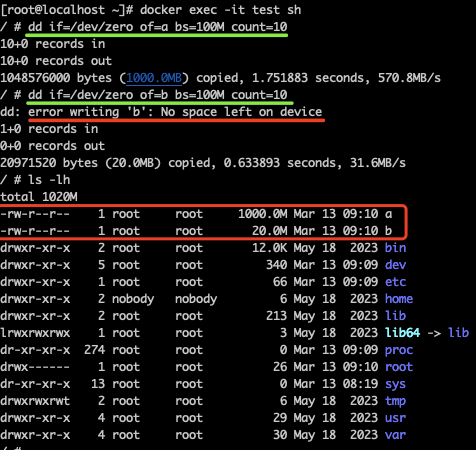

# Disk Limit in a Docker-based K8s Cluster

Docker provides configuration options to limit the disk space that a container can use.
This limit affects both the image and the container's filesystem, with a default value of 10G.
This article will guide you on how to configure parameters to change this value when deploying a cluster.

## Prerequisites

According to the Docker official documentation on overlay2-options, before configuring
Docker overlay2.size, you need to adjust the filesystem type to xfs in the operating system.

- The cluster runtime is Docker.
- The node's operating system filesystem type is xfs.

Additionally, this procedure uses CentOS 7 as an example. The basic information of the node is as follows:

```bash
$ cat /etc/os-release
NAME="CentOS Linux"
VERSION="7 (Core)"
ID="centos"
ID_LIKE="rhel fedora"
VERSION_ID="7"
PRETTY_NAME="CentOS Linux 7 (Core)"
ANSI_COLOR="0;31"
CPE_NAME="cpe:/o:centos:centos:7"
HOME_URL="https://www.centos.org/"
BUG_REPORT_URL="https://bugs.centos.org/"
 
CENTOS_MANTISBT_PROJECT="CentOS-7"
CENTOS_MANTISBT_PROJECT_VERSION="7"
REDHAT_SUPPORT_PRODUCT="centos"
REDHAT_SUPPORT_PRODUCT_VERSION="7"
 
$ uname -a
Linux localhost.localdomain 3.10.0-957.el7.x86_64 # (1)!
```

1. SMP Thu Nov 8 23:39:32 UTC 2018 x86_64 x86_64 x86_64 GNU/Linux

## Operation Guide

- Refer to the container management
  [Create Cluster](../../kpanda/user-guide/clusters/create-cluster.md) documentation.
  After filling in other information, navigate to the **Advanced Configuration** module.

- In the **Advanced Configuration** interface, add the following line in the custom parameters:

    ```config
    docker_storage_options: -s overlay2 --storage-opt overlay2.size=1G
    ```

    

    This parameter limits the maximum disk usage of a single Docker container to 1G.
    Any write operations beyond 1G will be denied.

## Validation

After the cluster deployment is complete, verify whether the
container disk usage limit is effective.

- Create a test container on the cluster node:

    ```bash
    docker run --name test -d busybox:latest sleep infinity
    ```

- Enter the container and test the disk usage limit with a large file:

    ```bash
    docker exec -it test sh

    dd if=/dev/zero of=a bs=100M count=10
    ```

- The expected behavior is that the creation of the initial 100M file `a` will succeed.
  However, when attempting to create another 100M file `b`, an error "No space left on device"
  will occur, indicating that the disk limit is in effect, as shown below:

    
