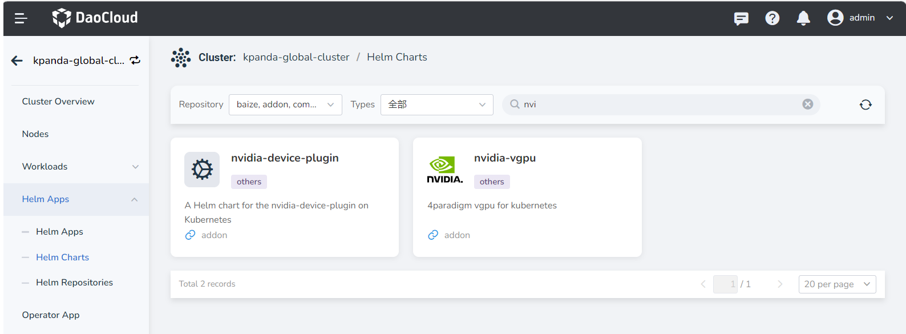

# Installing NVIDIA vGPU Addon

To virtualize a single NVIDIA GPU into multiple virtual GPUs and allocate them to different virtual machines or users, you can use NVIDIA's vGPU capability.
This section explains how to install the vGPU plugin in the DCE 5.0 platform, which is a prerequisite for using NVIDIA vGPU capability.

## Prerequisites

- Refer to the [GPU Support Matrix](../../gpu_matrix.md) to confirm that the nodes in the cluster have GPUs of the corresponding models.
- The current cluster has deployed NVIDIA drivers through the Operator. For specific instructions, refer to [Offline Installation of GPU Operator](../install_nvidia_driver_of_operator.md).

## Procedure

1. Path: __Container Management__ -> __Cluster Management__ -> Click the target cluster -> __Helm Apps__ -> __Helm Charts__ -> Search for __nvidia-vgpu__ .

    

2. During the installation of vGPU, several basic modification parameters are provided. If you need to modify advanced parameters, click the YAML column to make changes:

    - __deviceMemoryScaling__ : NVIDIA device memory scaling factor, the input value must be an integer, with a default value of 1. It can be greater than 1 (enabling virtual memory, experimental feature). For an NVIDIA GPU with a memory size of M, if we configure the __devicePlugin.deviceMemoryScaling__ parameter as S, in a Kubernetes cluster where we have deployed our device plugin, the vGPUs assigned from this GPU will have a total memory of __S * M__ .

    - __deviceSplitCount__ : An integer type, with a default value of 10. Number of GPU splits, each GPU cannot be assigned more tasks than its configuration count. If configured as N, each GPU can have up to N tasks simultaneously.

    - __Resources__ : Represents the resource usage of the vgpu-device-plugin and vgpu-schedule pods.

    

3. After a successful installation, you will see two types of pods in the specified namespace, indicating that the NVIDIA vGPU plugin has been successfully installed:

      

After a successful installation, you can [deploy applications using vGPU resources](vgpu_user.md).

!!! note

    NVIDIA vGPU Addon does not support upgrading directly from the older version v2.0.0 to the
    latest version v2.0.0+1; To upgrade, please uninstall the older version and then reinstall the latest version.
