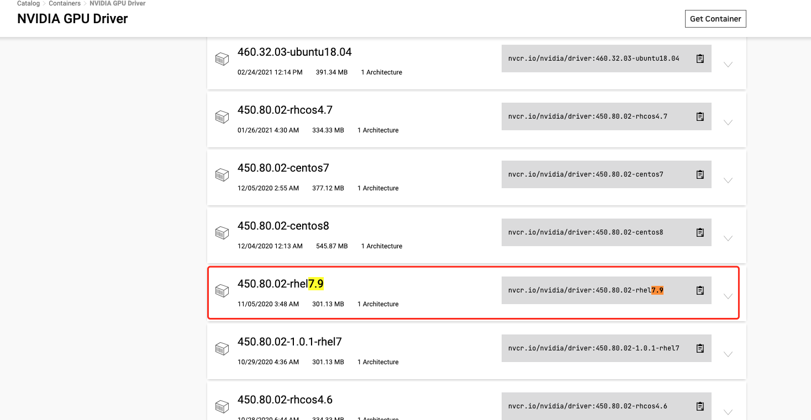

# Build an Offline Yum Repository for Red Hat 7.9

## Introduction

DCE 5.0 comes with a pre-installed CentOS 7.9 with GPU Operator offline package for kernel 3.10.0-1160.
You need to manually build an offline yum repository for other OS types or nodes with different kernels.

This page explains how to build an offline yum repository for Red Hat 7.9 based on any node in the Global cluster, and how to use the `RepoConfig.ConfigMapName` parameter when installing the GPU Operator.

## Prerequisites

1. You have installed the v0.12.0 or higher version of the
   [addon offline package](../../../../download/addon/history.md) on the platform.
2. The cluster nodes where the GPU Operator is to be deployed must be Red Hat 7.9 with the exact same kernel version.
3. Prepare a file server that can be connected to the cluster network where the GPU Operator is to be deployed, such as nginx or minio.
4. Prepare a node that can access the internet, the cluster where the GPU Operator is to be deployed,
   and the file server. [Docker installation](../../../../install/community/kind/online.md#install-docker) must be completed on this node.
5. The nodes in the Global cluster must be Red Hat 7.9.

## Steps

### 1. Build Offline Yum Repo for Relevant Kernel

1. [Download rhel7.9 ISO](https://developers.redhat.com/products/rhel/download#assembly-field-downloads-page-content-61451)

    

2. Download the [rhel7.9 ospackage](https://github.com/kubean-io/kubean/releases) that corresponds to your Kubean version.

    Find the version number of Kubean in the **Container Management** section of the Global cluster under **Helm Apps**.

    <!--  -->

    Download the rhel7.9 ospackage for that version from the
    [Kubean repository](https://github.com/kubean-io/kubean/releases).

    

3. Import offline resources using the installer.

    Refer to the [Import Offline Resources document](../../../../install/import.md).

### 2. Download Offline Driver Image for Red Hat 7.9 OS

[Click here to view the download url](https://catalog.ngc.nvidia.com/orgs/nvidia/containers/driver/tags).



### 3. Upload Red Hat GPU Operator Offline Image to Boostrap Node Repository

Refer to [Upload Red Hat GPU Operator Offline Image to Boostrap Node Repository](./push_image_to_repo.md).

!!! note

    This reference is based on rhel8.4, so make sure to modify it for rhel7.9.

### 4. Create ConfigMaps in the Cluster to Save Yum Repository Information

Run the following command on the control node of the cluster where the GPU Operator is to be deployed.

1. Run the following command to create a file named __CentOS-Base.repo__ to specify the configuration information where the yum repository is stored.

    ```bash
    # The file name must be CentOS-Base.repo, otherwise it will not be recognized when installing gpu-operator
    cat > CentOS-Base.repo <<  EOF
    [extension-0]
    baseurl = http://10.5.14.200:9000/centos-base/centos-base # The server file address of the boostrap node, usually {boostrap node IP} + {9000 port}
    gpgcheck = 0
    name = kubean extension 0
    
    [extension-1]
    baseurl = http://10.5.14.200:9000/centos-base/centos-base # The server file address of the boostrap node, usually {boostrap node IP} + {9000 port}
    gpgcheck = 0
    name = kubean extension 1
    EOF
    ```

2. Based on the created __CentOS-Base.repo__ file, create a profile named __local-repo-config__ in the gpu-operator namespace:

    ```bash
    kubectl create configmap local-repo-config -n gpu-operator --from-file=CentOS-Base.repo=/etc/yum.repos.d/extension.repo
    ```

    The expected output is as follows:

    ```console
    configmap/local-repo-config created
    ```

    The __local-repo-config__ profile is used to provide the value of the `RepoConfig.ConfigMapName` parameter when installing gpu-operator, and the profile name can be customized by the user.

3. View the contents of the __local-repo-config__ profile:

    ```bash
    kubectl get configmap local-repo-config -n gpu-operator -oyaml
    ```

    The expected output is as follows:

    ```yaml title="local-repo-config.yaml"
    apiVersion: v1
    data:
      CentOS-Base.repo: "[extension-0]\nbaseurl = http://10.6.232.5:32618/centos-base # The file path where yum repository is placed in Step 2 \ngpgcheck = 0\nname = kubean extension 0\n  \n[extension-1]\nbaseurl
      = http://10.6.232.5:32618/centos-base # The file path where yum repository is placed in Step 2 \ngpgcheck = 0\nname
      = kubean extension 1\n"
    kind: ConfigMap
    metadata:
      creationTimestamp: "2023-10-18T01:59:02Z"
      name: local-repo-config
      namespace: gpu-operator
      resourceVersion: "59445080"
      uid: c5f0ebab-046f-442c-b932-f9003e014387
    ```

At this point, you have successfully created the offline yum repository profile for the cluster
where the GPU Operator is to be deployed. The `RepoConfig.ConfigMapName` parameter was used during the
[Offline Installation of GPU Operator](./install_nvidia_driver_of_operator.md).
