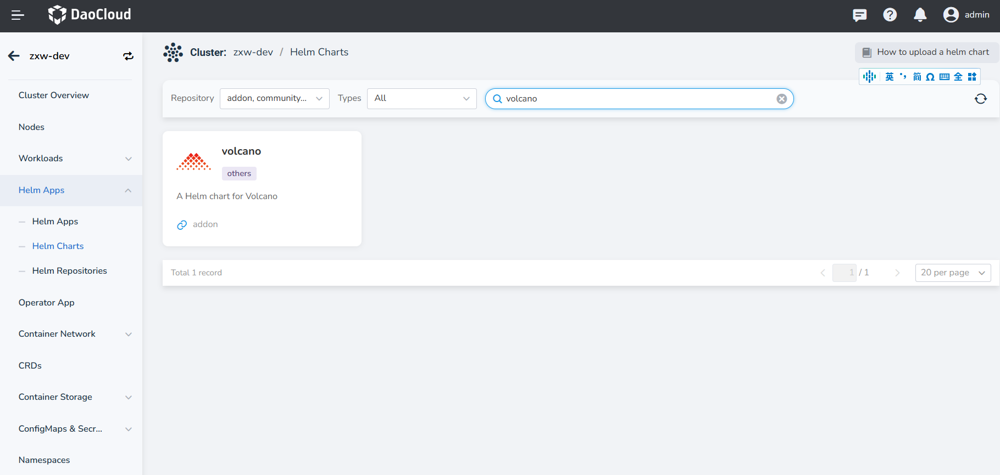
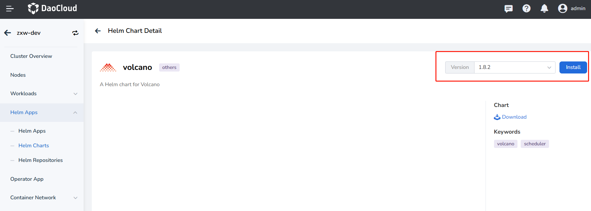
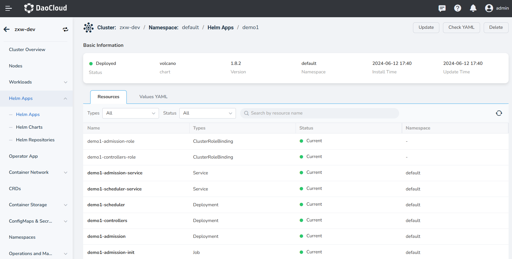

# Volcano Installation and Usage

Volcano is the first container batch computing platform based on Kubernetes under CNCF, focusing on 
high-performance computing scenarios.
It adds features related to machine learning, big data, and scientific computing that Kubernetes is not equipped with. 
providing necessary support for these high-performance workloads.

Volcano seamlessly integrates with mainstream computing frameworks such as Spark, TensorFlow, and PyTorch, 
and supports mixed scheduling of heterogeneous devices, including CPU and GPU.

This page introduces how to install and use Volcano.

## Install Volcano

1. Find Volcano in **Cluster Details** -> **Helm Apps** -> **Helm Charts** and install it.

    
   
    

2. Check and confirm whether Volcano is installed successfully, that is, whether the components volcano-admission, 
   volcano-controllers, and volcano-scheduler are running properly.

    

## Volcano Usage Scenarios

### Scheduling Job Resources with Volcano

- Volcano is a separate scheduler, and you specify the name of the scheduler (schedulerName: volcano) when creating workloads.
- The volcanoJob resource is an extension of Job by Volcano, which splits the job into smaller units of work called tasks, 
  which can interact with each other.

Here is an example:

```yaml
apiVersion: batch.volcano.sh/v1alpha1
kind: Job
metadata:
  name: nginx-job
spec:
  minAvailable: 2
  schedulerName: volcano
  tasks:
    - replicas: 1
      name: master
      template:
        spec:
          containers:
            - image: docker.m.daocloud.io/library/nginx:latest
              name: mpimaster
    - replicas: 2
      name: worker
      template:
        spec:
          containers:
            - image: docker.m.daocloud.io/library/nginx:latest
              name: mpiworker
```

### Parallel Computing with MPI

Here is an example:

```yaml
apiVersion: batch.volcano.sh/v1alpha1
kind: Job
metadata:
  name: lm-mpi-job
  labels:
    "volcano.sh/job-type": "MPI" # Volcano natively supports scheduling MPI jobs
spec:
  minAvailable: 4
  schedulerName: volcano
  plugins:
    ssh: [] # Volcano plugin, allows passwordless login between master and worker
    svc: [] # Allows network access between master and worker, automatically creates headless svc resources
  policies:
    - event: PodEvicted
      action: RestartJob
  tasks:
    - replicas: 1
      name: mpimaster
      policies:
        - event: TaskCompleted
          action: CompleteJob
      template:
        spec:
          containers:
            - command:
                - /bin/sh
                - -c
                - |
                  MPI_HOST=`cat /etc/volcano/mpiworker.host | tr "\n" ","`;
                  mkdir -p /var/run/sshd; /usr/sbin/sshd;
                  mpiexec --allow-run-as-root --host ${MPI_HOST} -np 3 mpi_hello_world;
              image: docker.m.daocloud.io/volcanosh/example-mpi:0.0.1
              name: mpimaster
              ports:
                - containerPort: 22
                  name: mpijob-port
              workingDir: /home
              resources:
                requests:
                  cpu: "500m"
                limits:
                  cpu: "500m"
          restartPolicy: OnFailure
          imagePullSecrets:
            - name: default-secret
    - replicas: 3
      name: mpiworker
      template:
        spec:
          containers:
            - command:
                - /bin/sh
                - -c
                - |
                  mkdir -p /var/run/sshd; /usr/sbin/sshd -D;
              image: docker.m.daocloud.io/volcanosh/example-mpi:0.0.1
              name: mpiworker
              ports:
                - containerPort: 22
                  name: mpijob-port
              workingDir: /home
              resources:
                requests:
                  cpu: "1000m"
                limits:
                  cpu: "1000m"
          restartPolicy: OnFailure
          imagePullSecrets:
            - name: default-secret
```

### Volcano Support for TensorFlow

Here is an example:

```yaml
apiVersion: batch.volcano.sh/v1alpha1
kind: Job
metadata:
  name: tensorflow-benchmark
  labels:
    "volcano.sh/job-type": "Tensorflow" # Volcano natively supports scheduling TensorFlow jobs
spec:
  minAvailable: 3
  schedulerName: volcano
  plugins:
    env: []
    svc: []
  policies:
    - event: PodEvicted
      action: RestartJob
  tasks:
    - replicas: 1
      name: ps
      template:
        spec:
          imagePullSecrets:
            - name: default-secret
          containers:
            - command:
                - sh
                - -c
                - |
                  PS_HOST=`cat /etc/volcano/ps.host | sed 's/$/&:2222/g' | tr "\n" ","`;
                  WORKER_HOST=`cat /etc/volcano/worker.host | sed 's/$/&:2222/g' | tr "\n" ","`;
                  python tf_cnn_benchmarks.py --batch_size=32 --model=resnet50 --variable_update=parameter_server --flush_stdout=true --num_gpus=1 --local_parameter_device=cpu --device=cpu --data_format=NHWC --job_name=ps --task_index=${VK_TASK_INDEX} --ps_hosts=${PS_HOST} --worker_hosts=${WORKER_HOST}
              image: docker.m.daocloud.io/volcanosh/example-tf:0.0.1
              name: tensorflow
              ports:
                - containerPort: 2222
                  name: tfjob-port
              resources:
                requests:
                  cpu: "1000m"
                  memory: "2048Mi"
                limits:
                  cpu: "1000m"
                  memory: "2048Mi"
              workingDir: /opt/tf-benchmarks/scripts/tf_cnn_benchmarks
          restartPolicy: OnFailure
    - replicas: 2
      name: worker
      policies:
        - event: TaskCompleted
          action: CompleteJob
      template:
        spec:
          imagePullSecrets:
            - name: default-secret
          containers:
            - command:
                - sh
                - -c
                - |
                  PS_HOST=`cat /etc/volcano/ps.host | sed 's/$/&:2222/g' | tr "\n" ","`;
                  WORKER_HOST=`cat /etc/volcano/worker.host | sed 's/$/&:2222/g' | tr "\n" ","`;
                  python tf_cnn_benchmarks.py --batch_size=32 --model=resnet50 --variable_update=parameter_server --flush_stdout=true --num_gpus=1 --local_parameter_device=cpu --device=cpu --data_format=NHWC --job_name=worker --task_index=${VK_TASK_INDEX} --ps_hosts=${PS_HOST} --worker_hosts=${WORKER_HOST}
              image: docker.m.daocloud.io/volcanosh/example-tf:0.0.1
              name: tensorflow
              ports:
                - containerPort: 2222
                  name: tfjob-port
              resources:
                requests:
                  cpu: "2000m"
                  memory: "2048Mi"
                limits:
                  cpu: "2000m"
                  memory: "4096Mi"
              workingDir: /opt/tf-benchmarks/scripts/tf_cnn_benchmarks
          restartPolicy: OnFailure
```

If you want to learn more about the features and usage scenarios of Volcano,
refer to [Volcano Introduction](https://volcano.sh/en/docs/).
