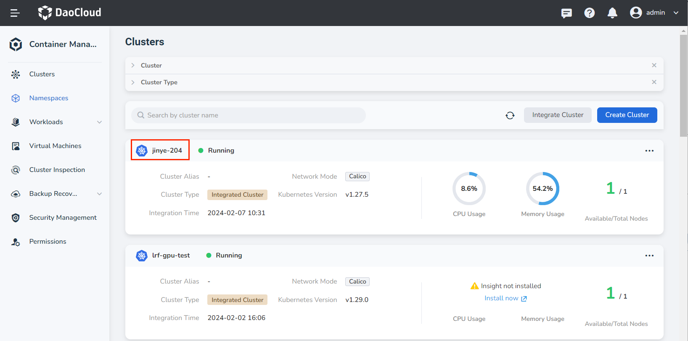

# Node Taint

Taint can make a node exclude a certain type of Pod and prevent Pod from being scheduled on the node.
One or more taints can be applied to each node, and Pods that cannot tolerate these taints will not be scheduled on that node.
For more details about taints, refer to the official Kubernetes documentation [Taints and Tolerance](https://kubernetes.io/docs/concepts/scheduling-eviction/taint-and-toleration/).

## Precautions

1. The current operating user should have [__NS Editor__](../permissions/permission-brief.md) role authorization or other higher permissions.
2. After adding a taint to a node, only Pods that can tolerate the taint can be scheduled to the node. <!--For how to set tolerance for Pod, refer to -->

## Steps

1. Find the target cluster on the __Clusters__ page, and click the cluster name to enter the Cluster page.

    

2. In the left navigation bar, click __Nodes__ , find the node that needs to modify the taint, click the __ⵗ__ operation icon on the right and click the __Edit Taints__ button.

    

3. Enter the key value information of the stain in the pop-up box, select the stain effect, and click __OK__ .

    Click __➕ Add__ to add multiple stains to the node, and click __X__ on the right side of the stain effect to delete the stain.

    Currently supports three stain effects:

    - NoSchedule: Pods that cannot tolerate a taint will not be scheduled on nodes with the taint.
    - PreferNoSchedule: **Try to avoid** Pods that cannot tolerate a taint will not be scheduled on nodes with the taint.
    - NoExecute: Keep the status quo. Pods that cannot tolerate a taint will not be evicted if they were already running on the node before the taint was set. Pods that cannot tolerate a taint will not be scheduled on the node if they were not running on the node before the taint was set on the node.

        
