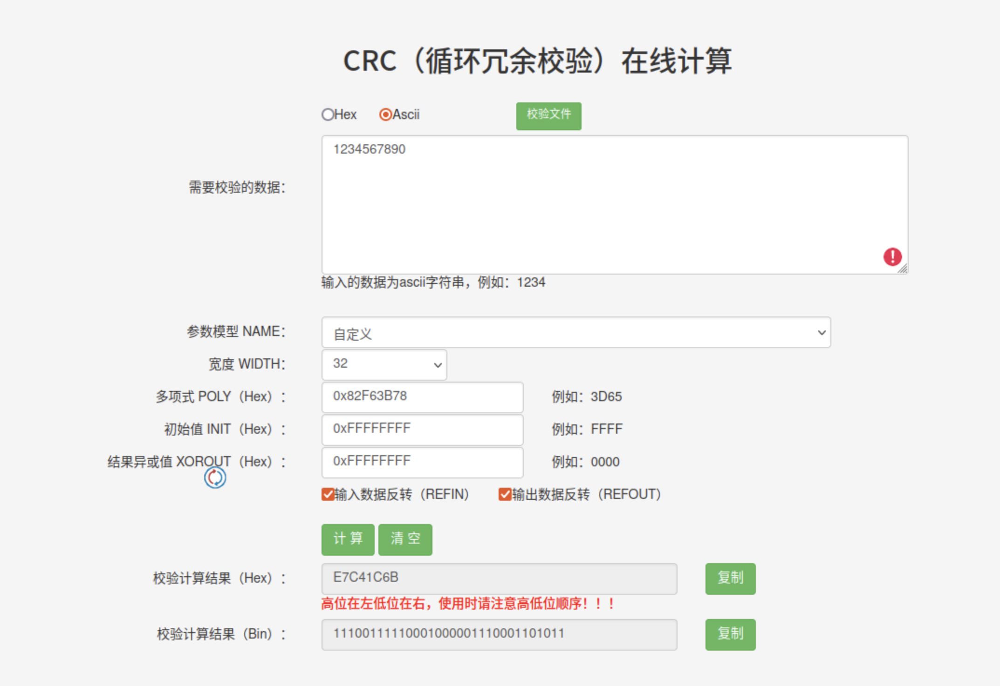

# Cloud Native Custom Plugin Example: envoy-extproc-crc32-check-demo-go

[Envoy-extproc-crc32-check-demo-go](https://github.com/projectsesame/envoy-extproc-crc32-check-demo-go) is an example based on [envoy-extproc-sdk-go](https://github.com/wrossmorrow/envoy-extproc-sdk-go), demonstrating how to use the [ext_proc](https://www.envoyproxy.io/docs/envoy/latest/configuration/http/http_filters/ext_proc_filter) feature provided by Envoy in Go.

Its main function is to perform CRC checksum verification on the request body before routing the request submitted by the downstream to the upstream. If the verification fails, it will directly respond with 403.

## Prerequisites

- Install Envoy (Version >= v1.29)
- Install Go (Version >= v1.21), this step can be skipped if you just want to run it
- A target service supporting HTTP Method: POST (hereinafter referred to as Upstream), assuming it supports the following routes:
    - `/*`
    - `/no-extproc`

## Compilation

Navigate to the project root directory (this step can be skipped if you just want to run it).

```bash
go build . -o extproc
```

## Running

- Envoy:

    ```bash
    envoy -c ./envoy.yaml # (1)!
    ```

    1. This file is located in the project root directory

- Caching:

    - Bare Metal:

        ```bash
        ./extproc crc32-check --log-stream --log-phases poly "0x82f63b78"
        ```

    - k8s:

        ```bash
        kubectl apply -f ./deployment.yaml # (1)!
        ```

        1. This file is located in the project root directory

- Curl

    ```bash
    curl --request POST \
     --url http://127.0.0.1:8080/post \
     --data '{
      "data": "1234567890",
      "crc32": "E7C41C6B",
     }'
    ```

## Parameter Description

- log-stream: Whether to output logs about the request/response stream
- log-phases: Whether to output logs for each processing phase
- update-extproc-header: Whether to add the name of this plugin in the response header
- update-duration-header: Add the total processing time in the response header when the stream ends

**All of the above parameters default to false.**

- poly 0x82f63b78: The polynomial used when generating the checksum, default is IEEE.

## Notes

1.  The first 4 command line parameters are global configuration parameters, meaning all plugins based on [envoy-extproc-sdk-go](https://github.com/wrossmorrow/envoy-extproc-sdk-go) will support them by default;
    while **poly 0x82f63b78** is a specific parameter for the plugin (envoy-extproc-crc32-check-demo-go), parsed and used by this plugin.

2.  In this example, MD5 is used as the "signature" algorithm for demonstration purposes only. For production, please use algorithms like SHA256WithRSA.

3.  The following fields are **mandatory** for each request:

    - **data**: The raw data used to generate the crc32
    - **crc32**: The checksum, the polynomial used by the client when calculating **must** be the same as the parameter in the plugin and other configuration parameters **must** be set to the following values as shown in [Fig 1](#__tabbed_1_1)

        ```output
        + **Bit Width**:                32
        + **REFIN**:                    true
        + **REFOUT**:                   true
        + **XOROUT (HEX)**:             0xFFFFFFFF
        + **Initial Value (HEX)**:      0xFFFFFFFF
        + **Polynomial Formula (HEX)**: 0x82F63B78
        ```

4.  The **request_body_mode** in the processing_mode must be configured as the option shown in the red box in [Fig 2](#__tabbed_1_2):

=== "Fig 1"

    

=== "Fig 2"

    
