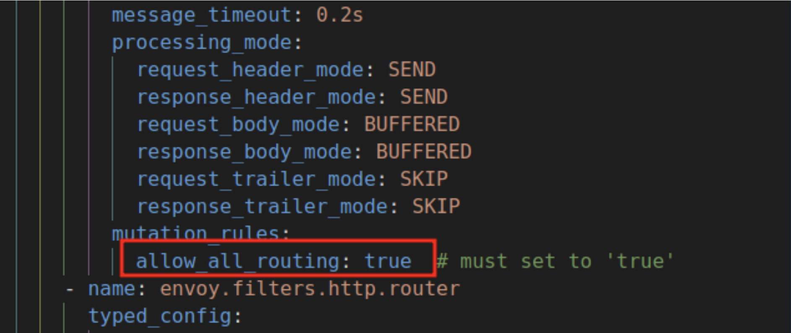

# Cloud Native Custom Plugin Example: envoy-extproc-method-conv-demo-go

[Envoy-extproc-method-conv-demo-go](https://github.com/projectsesame/envoy-extproc-method-conv-demo-go) is an example based on [envoy-extproc-sdk-go](https://github.com/wrossmorrow/envoy-extproc-sdk-go), demonstrating how to use the [ext_proc](https://www.envoyproxy.io/docs/envoy/latest/configuration/http/http_filters/ext_proc_filter) feature provided by Envoy in Go.

## Functionality

Its main function is to convert **GET/POST** requests initiated by the downstream into **POST/GET** requests before sending them to the upstream, thereby achieving the purpose of request method conversion.

## Prerequisites

- Install Envoy (Version >= v1.29)
- Install Go (Version >= v1.21), this step can be skipped if you just want to run it
- A target service supporting HTTP Method: GET/POST (hereinafter referred to as Upstream), assuming it supports the following routes:

    - `/*`
    - `/no-extproc`

## Compilation

Navigate to the project root directory (this step can be skipped if you just want to run it).

```bash
go build . -o extproc
```

## Running

- Envoy:

    ```bash
    envoy -c ./envoy.yaml # (1)!
    ```

    1. This file is located in the project root directory

- Caching:

    - Bare Metal:

        ```bash
        ./extproc method-conv --log-stream --log-phases
        ```

    - k8s:

        ```bash
        kubectl apply -f ./deployment.yaml # (1)!
        ```

        1. This file is located in the project root directory

- Curl

    ```bash
    curl 127.0.0.1:8000/no-extproc  # (1)!
    curl 127.0.0.1:8000/foo  # (2)!
    curl -XPOST 127.0.0.1:8000/bar  # (3)!
    ```

    1. Method-conv will not act on this route, each request will be routed to the upstream as is
    2. This GET request will be converted to a POST by Method-conv and then routed to the upstream
    3. This POST request will be converted to a GET by Method-conv and then routed to the upstream

## Parameter Description

- log-stream: Whether to output logs about the request/response stream
- log-phases: Whether to output logs for each processing phase
- update-extproc-header: Whether to add the name of this plugin in the response header
- update-duration-header: Add the total processing time in the response header when the stream ends

**All of the above parameters default to false.**

## Notes

1. This example only supports conversion between HTTP Methods: GET and POST.

2. The **allow_all_routing** in mutation_rules must be set to **true** , as shown in the red box in the image below:

    
