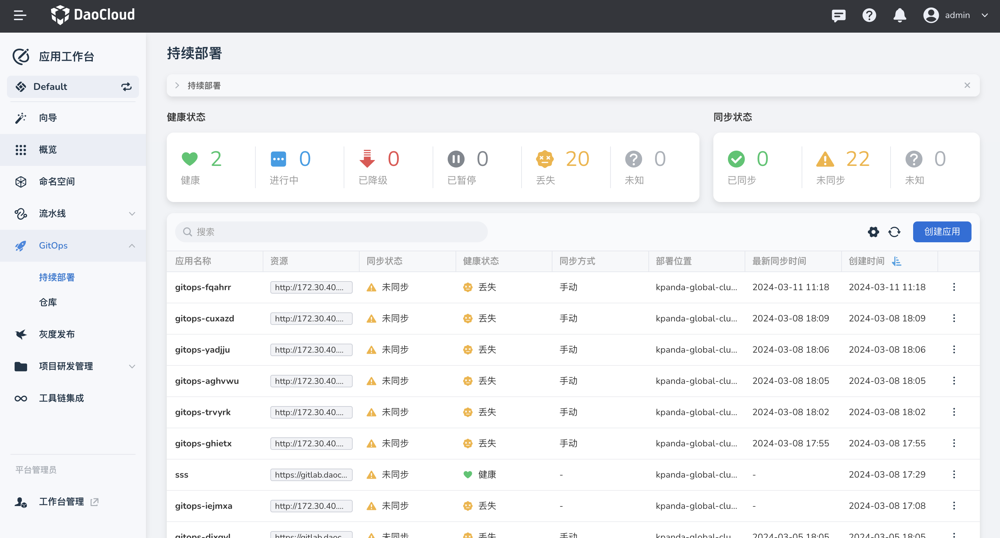
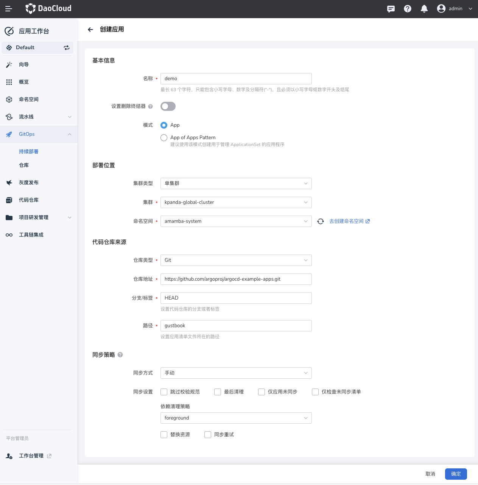
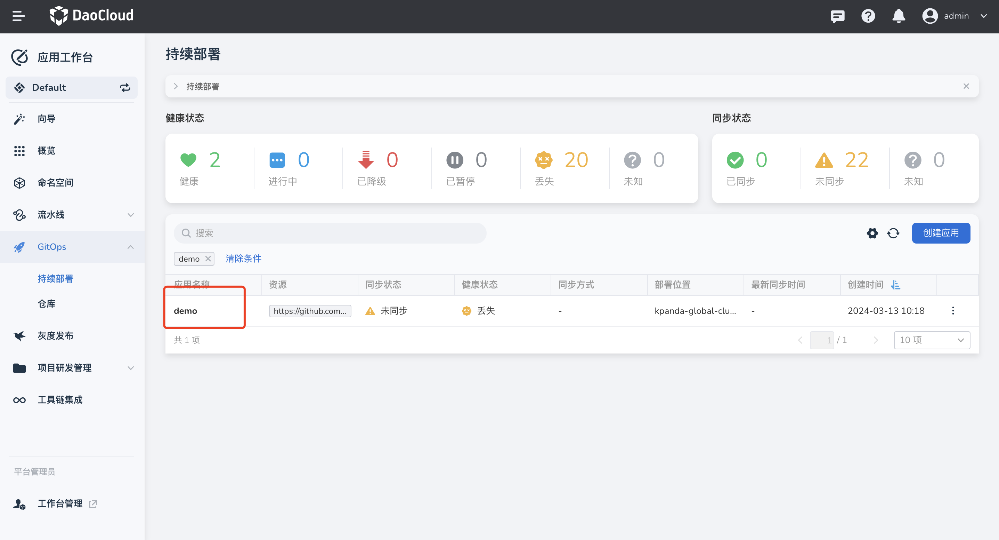
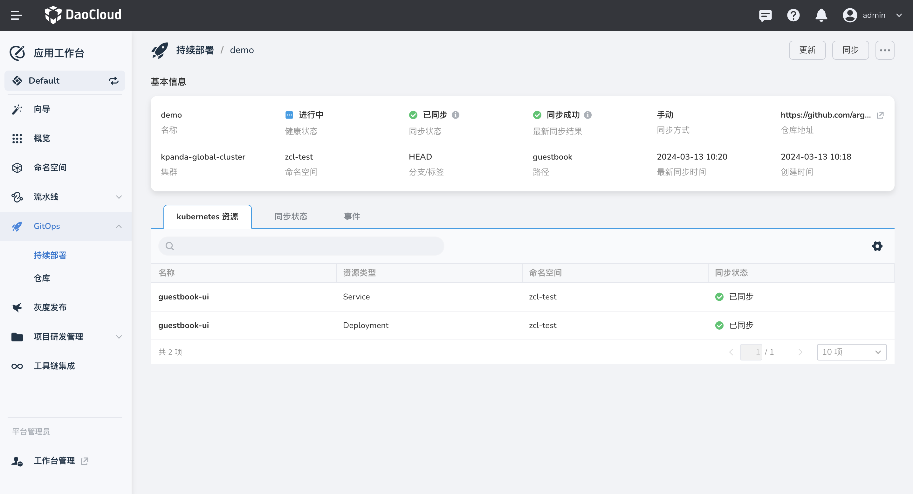

# 创建 Argo CD 应用

应用工作台基于开源软件 [Argo CD](https://argo-cd.readthedocs.io/en/stable/) 实现持续部署。本页面演示如何实现应用的持续部署。

## 前提条件

- 需创建一个工作空间和一个用户，该用户需加入该工作空间并赋予  __workspace edit__  角色。
  参考[创建工作空间](../../../ghippo/user-guide/workspace/workspace.md)、[用户和角色](../../../ghippo/user-guide/access-control/user.md)。
- 准备一个 Git 仓库，如果持续部署应用的清单文件所在的代码仓库不是公开的，则需要事先将仓库导入至应用工作台，参考[导入仓库](import-repo.md)。

## 创建 Argo CD 应用

1. 在 __应用工作台__ -> __持续发布__ 页面中，点击 __创建应用__ 按钮。

    

1. 在 __创建应用__ 页面中，分配配置 __基本信息__ 、 __部署位置__ 、 __代码仓库来源__ 和 __同步策略__ 后，点击 __确定__ 。

    - 代码仓库来源：
        - 代码仓库：选择已导入的代码仓库或者输入公开的代码仓库地址。例如：`https://github.com/argoproj/argocd-example-apps.git`
        - 分支/标签：设置代码仓库的分支或标签，默认为HEAD
        - 路径：填写清单文件路径，例如 gustbook
    - 同步策略：
        - 手动同步：手动点击是否同步
        - 自动同步：自动检测代码仓库中清单文件的变化，一旦变化后就会立即同步应用资源至最新状态。并支持清理资源和自恢复选项：
            - 清理资源：同步时删除代码仓库不再定义的资源
            - 自恢复：确保与代码仓库中期望的状态同步
        - 同步设置：
            - 跳过校验规范：跳过应用清单文件规范校验
            - 最后清理：当所有的资源都已经同步且处于健康状态后，才会删除不存在的资源
            - 仅应用未同步：仅应用未同步的资源
            - 依赖清理策略：选择一个具体的清理策略：
                - foreground：先删除完所有依赖对象之后， 再删除属主对象
                - background：先删除属主对象之后，再删除所有依赖对象
                - orphan：删除属主对象之后，所有依赖对象仍然存在
            - 替换资源：是否需要替换已存在的资源
            - 同步重试：对应用同步重试参数化，支持设置重试最大次数、重试持续时间、重试持续最大时间、因子

    

## 查看应用

1. 创建成功后，点击应用名称进入详情页面，可以查看应用详情。

    

1. 由于同步方式选择的是 __手动同步__ ，所以我们需要手动进行同步，点击 __同步__ 。

    

1. 同步过程中具体参数说明请参考[手动同步应用](./sync-manually.md)，点击 __确定__ 。

    

1. 等待同步成功后，查看同步结果。

    
