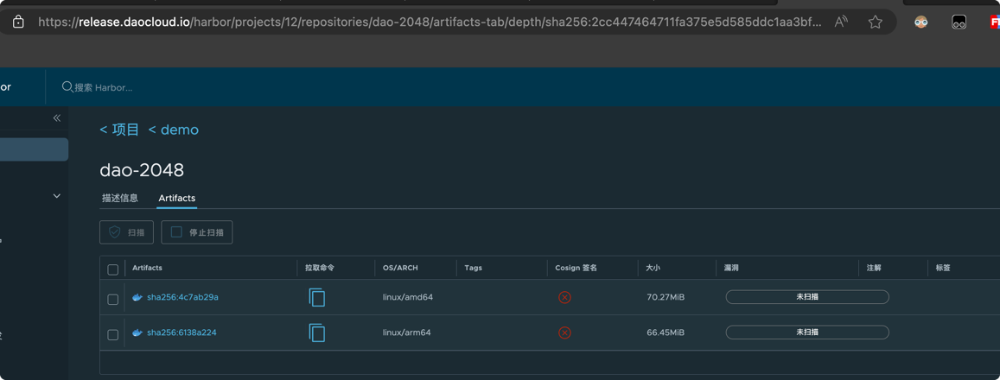

# 通过流水线构建多架构镜像

在 Jenkins 中，采用 Podman 来代替 Docker 作为构建镜像的工具，主要是因为 Podman 不需要挂载 docker.sock，
同时 Podman 支持 rootless 模式，可以在不需要 root 权限的情况下使用，安全性更高。

在 Jenkinsfile 中，可以直接使用 Docker 命令或者 Podman 命令，大部分情况下是相同的。
目前已经使用 Podman 代替了 Docker（alias docker=podman），执行 Docker 命令时，实际上是调用 Podman 来执行的。

## 构建镜像的前提

与 Docker 类似，Docker 支持多平台构建的前提是需要宿主机支持多平台构建，利用 QEMU 来模拟其他平台的环境。在构建多架构镜像之前，需要进行一下两项配置：

### 配置 binfmt_misc 模块
配置`binfmt_misc`模块(**必须**)，`binfmt_misc`是Linux内核的一个模块，可以在内核中注册一个二进制格式，使得内核能够识别并执行这种格式的二进制文件。
因为`binfmt_misc`模块权限较高，需要**root权限**才能操作，所以需要**手动在所有运行 Agent 的宿主机上执行**以下操作：

```shell
find /proc/sys/fs/binfmt_misc -type f -name 'qemu-*' -exec sh -c 'echo -1 > {}'
wget -O qemu-binfmt-conf.sh https://raw.githubusercontent.com/qemu/qemu/master/scripts/qemu-binfmt-conf.sh && chmod +x qemu-binfmt-conf.sh && ./qemu-binfmt-conf.sh --qemu-suffix "-static" --qemu-path "/usr/bin"
```

### 安装 QEMU 的二进制文件

目前工作台内置的基础镜像(`base`,`go`,`nodejs`,`python`,`maven`) 中已经包含了qemu的二进制文件，不需要单独操作。

如果您的 Agent 镜像不是上述的基础镜像，您可以通过以下两种方式添加qemu的二进制文件：

1. 在 Dockerfile 中添加 qemu 的安装命令
    ```dockerfile
    # 添加下面的命令到 Dockerfile 中，需要根据您的目标平台选择对应的 qemu 二进制文件, 以目标镜像为arm64为例
    FROM --platform=linux/amd64 multiarch/qemu-user-static:aarch64 as qemu
    COPY --from=qemu /usr/bin/qemu-aarch64-static /usr/bin
    ```
2. 在您的 Agent 镜像中通过如下脚本直接添加 qemu 的二进制文件

    ```shell
    arch="aarch64"
    version="v7.2.0-1"
    wget -O qemu-${arch}-static https://github.com/multiarch/qemu-user-static/releases/download/${version}/qemu-${arch}-static && chmod +x qemu-${arch}-static && mv qemu-${arch}-static /usr/bin 
    ```

关于 QEMU 和 binfmt_misc 的更多信息，请参考：

- [Kernel Support for miscellaneous Binary Formats (binfmt_misc)](https://www.kernel.org/doc/html/latest/admin-guide/binfmt-misc.html)
- [QEMU User Emulation](https://wiki.debian.org/QemuUserEmulation)

## 构建多平台镜像

Podman 兼容 Dockerfile 的语法，但是实际上并不支持 Dockerfile 中的 `--platform` 参数（即不支持交叉编译），
采用的依旧是 QEMU 模拟其他平台的环境（仿真），因此构建速度也会比 Docker 慢。

Podman 不支持直接通过 `--platform` 一次性打出多个平台的镜像，需要打出多个平台的镜像后使用 Podman 的 `manifest` 命令进行合并，
不过支持在 build 命令中添加 manifest 参数便捷地添加镜像到 manifest 中。

以构建 Dao-2048 镜像为例，Dockerfile 如下：

```dockerfile
FROM nginx # 如果需要构建多平台镜像，需要保证基础镜像支持多平台
COPY . /usr/share/nginx/html
EXPOSE 80
CMD sed -i "s/ContainerID: /ContainerID: "$(hostname)"/g" /usr/share/nginx/html/index.html && nginx -g "daemon off;"
```

### 在构建镜像时指定 manifest 参数

步骤如下

```shell
target=release.daocloud.io/demo/dao-2048:v1  # 最终镜像的名称
platform=linux/amd64,linux/arm64 # 需要构建的平台
docker build -f Dockerfile --platform=$platform  --manifest release.daocloud.io/demo/dao-2048:v1 . # 构建多架构镜像
docker login xxx # 登录镜像仓库
docker manifest push --all $target # 推送
```

最终构建出的镜像如下，包含了 amd64 和 arm64 两个平台的镜像：



当然，如果直接在 Jenkinsfile 中使用 Docker 命令，不支持 manifest 参数，可以通过单独构建镜像的方式来实现，最终效果也是相同的，步骤如下：

1. 打出不同平台的镜像

    ```shell
    docker build -t release.daocloud.io/demo/dao-2048-amd -f Dockerfile . --platform=linux/amd64
    docker build -t release.daocloud.io/demo/dao-2048-arm -f Dockerfile . --platform=linux/arm64
    ```

2. 使用 podman manifest create 创建 manifest 镜像

    ```shell
    docker manifest create release.daocloud.io/demo/dao-2048:v1
    ```

3. 使用 podman manifest add 将不同平台的镜像添加到 manifest 镜像中

    ```shell
    docker manifest add release.daocloud.io/demo/dao-2048:v1 release.daocloud.io/demo/dao-2048-amd
    docker manifest add release.daocloud.io/demo/dao-2048:v1 release.daocloud.io/demo/dao-2048-arm
    ```

4. 使用 podman manifest push 将 manifest 镜像推送到镜像仓库

    ```shell
    podman manifest push --all release.daocloud.io/demo/dao-2048:v1
    ```

## Jenkinsfile 示例

```groovy
pipeline {
  agent {
    node {
      label 'base'
    }

  }
  stages {
    stage('clone') {
      agent none
      steps {
        container('base') {
          git(branch: 'master', credentialsId: 'zxw-gitlab', url: 'https://gitlab.daocloud.cn/ndx/dao-2048.git')
        }

      }
    }

    stage('build & push') {
      agent none
      steps {
        container('base') {
          sh '''pwd
ls -a

target=release.daocloud.io/demo/dao-2048:v1
platform=linux/amd64,linux/arm64
docker build -f Dockerfile --platform=$platform  --manifest release.daocloud.io/demo/dao-2048:v1 .
docker manifest push --all $target'''
        }

      }
    }

  }
}
```
