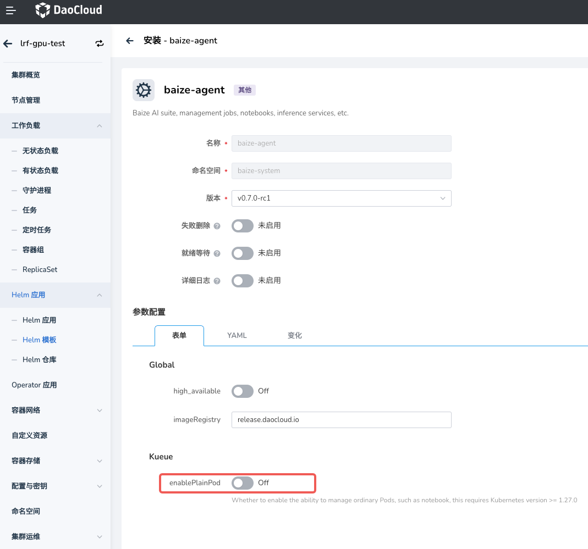

# Notebook 不受队列配额控制

## 问题现象

在智能算力中，用户在创建 Notebook 时，发现选择的队列即使资源不足，Notebook 依然可以创建成功。

## 问题分析 01:  Kubernetes 版本不支持

智能算力中的队列管理能力有 `Kueue` 提供，`Notebook` 服务是通过 `JupyterHub` 提供的。
`JupyterHub` 对 `Kubernetes` 的版本要求较高，对于低于 `v1.27` 的版本，即使在 `DCE` 中设置了队列配额，
用户在创建 `Notebook` 时也选择了配额，但 Notebook 实际也不会受到队列配额的限制。

### 解决方案

提前规划，生产环境中建议使用 `Kubernetes` 版本 `v1.27` 以上。

### 相关信息

- [Jupyter Notebook Documentation](https://jupyter-notebook.readthedocs.io/en/latest/)

## 问题分析 02:  配置未启用

> 当 Kubernetes 集群版本 大于 v1.27 时， `Notebook` 仍无法受到队列配额的限制。

这是因为，`Kueue` 需要启用对 `enablePlainPod` 支持，才会对 `Notebook` 服务生效。

### 解决方案

在工作集群中部署 `baize-agent` 时，启用 Kueue 对 `enablePlainPod` 的支持。

### 相关信息

- [Run Plain Pods as a Kueue-Managed Job](https://kueue.sigs.k8s.io/docs/tasks/run/plain_pods/)
