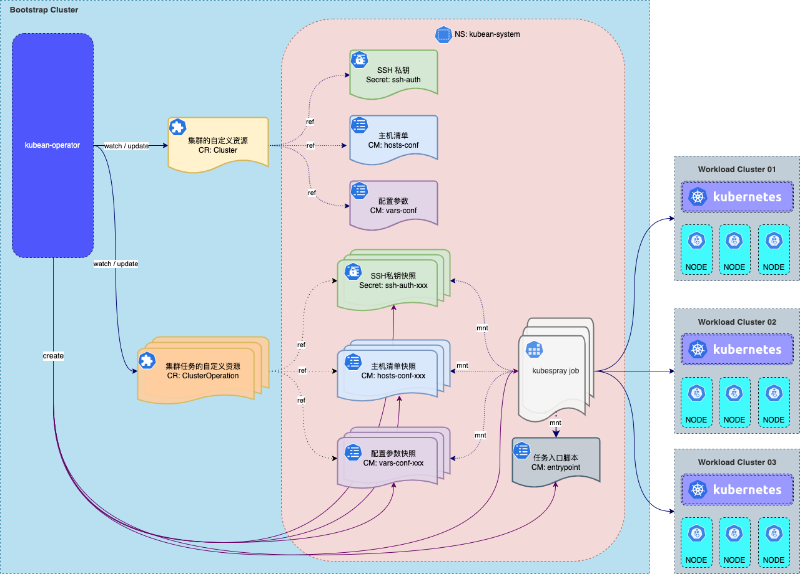

# 一颗绿色豆荚入选 CNCF Sandbox

2024 年 4 月，CNCF 社区有一颗绿意盎然的豆荚（Kubean）成功入选了 Sandbox。

这几年 DaoCloud 一直有几位开发者在 Kubespray 社区承担代码维护的职责，
2022 年中旬，在开叔和潇哥的建议下，随手在 CNCF 社区撒下了一颗绿色的豆荚 [Kubean](https://kubean-io.github.io/kubean/zh/)。
这颗幼小的豆荚经过两年多时间的辛勤浇灌，逐渐发芽，开始成长。

2024 年 4 月 15 日，经过 [CNCF TAG 委员会 11 人投票](https://github.com/cncf/sandbox/issues/49)，
其中 8 人赞成，3 人未投票，投票结果超过了 66% 的阈值，成功入选了业界知名的 Sandbox 沙箱进一步孵化。

## 这个豆荚能干什么

Kubean 这个豆荚本质上是一个 Operator，为容器化集群提供 CR 资源，能够以 Job 的形式完成集群部署等操作。
就像传说中撒豆成兵的仙界将帅一样，只要你有一个集群打底，就可以通过 Kubean 用多种方式在各种环境下部署一个又一个的新生集群。

- 支持 Operator 和 Helm Chart 方式声明式方式从零部署集群，支持 D1、D2 高效运维集群（扩容、升级、卸载等）
- 支持在裸金属、虚拟机、云平台等各种环境上部署 K8s 集群
- 支持几乎所有 Linux 发行版
- 支持日志追溯，方便集群运维（升级、扩展、卸载），也方便将集群回滚到某个作业状态
- 支持 Kubespray 等引擎
- 支持离线安装和升级

这是 Kubean 的整体架构图：

Kubean 需要运行在一个已存在的 Kubernetes 集群上，通过标准 CRD 资源和 Kubernetes 内建资源来控制和管理集群的生命周期（安装、卸载、升级、扩容、缩容等）。
Kubean 采用 Kubespray 作为底层技术依赖，一方面简化了集群部署的操作流程，降低了用户的使用门；
另一方面在 Kubespray 能力基础上增加了集群操作记录、离线版本记录等诸多新特性。

这个豆荚有四粒豆：

- 豆一 Cluster Controller：监视 Cluster Objects。
  唯一标识一个集群，拥有集群节点的访问信息、类型信息、部署参数信息，并且关联所有对此集群的操作（ClusterOperation Objects）；
- 豆二 ClusterOperation Controller：监视 ClusterOperation Objects。
  当 ClusterOperation Object 被创建时，控制器会组装一个 Job 去执行 CRD 对象里定义的操作；
- 豆三 Manifest Controller：监视 Manifest Objects。
  用于记录和维护当前版本的 Kubean 使用和兼容的组件、包及版本；
- 豆四 LocalArtifactSet Controller：监视 LocalArtifactSet Objects。
  用于记录离线包支持的组件及版本信息。

## 与 Kubespray 对比

Kubespray 是隶属于 kubernetes-sigs 生态，专为生产集群部署所设计的开源项目。
Kubean 最初是在 Kubespray 基础上开发的，又新增了一些功能，以下是简单的对比：

|         | Kubean | Kubespray |
| ------- | ----- | ----- |
| 支持的环境 | 裸金属、虚拟机、云平台 | 裸金属、虚拟机、云平台 |
| 支持的 OS | 更多 | 多 |
| 集成插件 | 支持 | 支持 |
| 集群增删改查 | 支持 | 支持 |
| Operator | 支持 | 不支持 |
| Helm Chart | 支持 | 不支持 |
| 离线安装 | 支持 | 支持得不好 |
| ARM 架构 | 支持 | 不支持 |

当然除了 Kubespray 之外，类似项目还有 KubeKey 和 Kops。
不过 KubeKey 的定位是一个跑在命令行上的 K8s/K3s 安装器，而 Kops 又强绑定 AWS 公有云，许多特性在其他云平台上不起作用。

## 沙箱之旅

Kubean 是在 2023 年 7 月下旬入选 CNCF Landscape 之后马上发起了加入 Sandbox 的申请。

8 月底 [ErikJiang](https://github.com/ErikJiang) 作为 Kubean 主要维护者，
在常规聆讯会议上向 CNCF TAG-Runtime 成员在线宣讲了 PPT，介绍 Kubean 的由来、功能特性和未来规划。

在接下来的几个月，陆续回答了 TAG 成员提出的诸多疑问，例如与 [Cluster API](https://github.com/kubernetes-sigs/cluster-api) 的区别，
ErikJiang 从 Kubean 的易用性方面增强了说服力。随后 TAG 委员会 [jberkus](https://github.com/jberkus)、
[caniszczyk](https://github.com/caniszczyk)、[rochaporto](https://github.com/rochaporto)
等人就 Kubean 的归属提出了新的方案：

- kubernetes-sigs/kubespray 子项目
- 还是 Sandbox 独立项目

开源因交流和碰撞而进步，Kubean 也是如此。这个豆荚本是诞生于 Kubespray 的枝桠上，
但现在大家发现它还可以基于更多引擎进一步发展壮大，这就消除了 TAG 委员会的顾虑。
事实上它不只是 Kubespray 的延伸，还可以是更多集群生命周期引擎的扩展，它是运行在旧时代发动机引擎之上的新产品，被赋予了全新的使命。

2024 年 4 月初，[raravena80](https://github.com/raravena80) 代表 TAG 决定接受 Kubean 进入沙箱，开启了投票流程。

2024 年 4 月 15 日，TAG 赞成票超过了 66% 的阈值，Kubean 开始了 [Sandbox Onboarding 入职流程](https://github.com/cncf/toc/issues/1301)。

## 幕后花絮

还有一件小事值得一提，2024 年初，Kubean 的一名代码维护者蒋航同学在周末闲暇时间，打开 GitHub 日常审查开源代码，偶尔发现 runc 容器逃逸引发的漏洞。
他提了 issue 跟社区几位开发者进行了讨论，然后提交了 PR 修复这个 CVE 漏洞。
后来这个编号为 CVE-2024-21626 的漏洞评分高达 8.6 分，号称是 runc 史上最严重的漏洞。
参见 [K8s runc 披露 8.6 分历史最高的安全漏洞](https://mp.weixin.qq.com/s/sx0XbdiiR9CRjoUNAeHSYA)。

也就是在 Kubean 项目组成员深度参与并修复了这次史上最严重的漏洞之后，TAG 委员会的态度有所缓和，认可了 Kubean 及其团队的价值。

总之，开源社区只要付出，就会有回报，这回报可以是项目被认可，也可以是个人水平和见识的增长。
在这个全球性的舞台上，努力一定会被人记住，今天有绿色豆荚的不同凡响，明天也许就有蓝色精灵的歌声传唱四方。

欢迎更多开发者参与贡献，共建繁荣社区，GitHub 项目地址： <https://github.com/kubean-io>

!!! tip "写在最后"

    世间安得两全法，不负如来不负卿。
