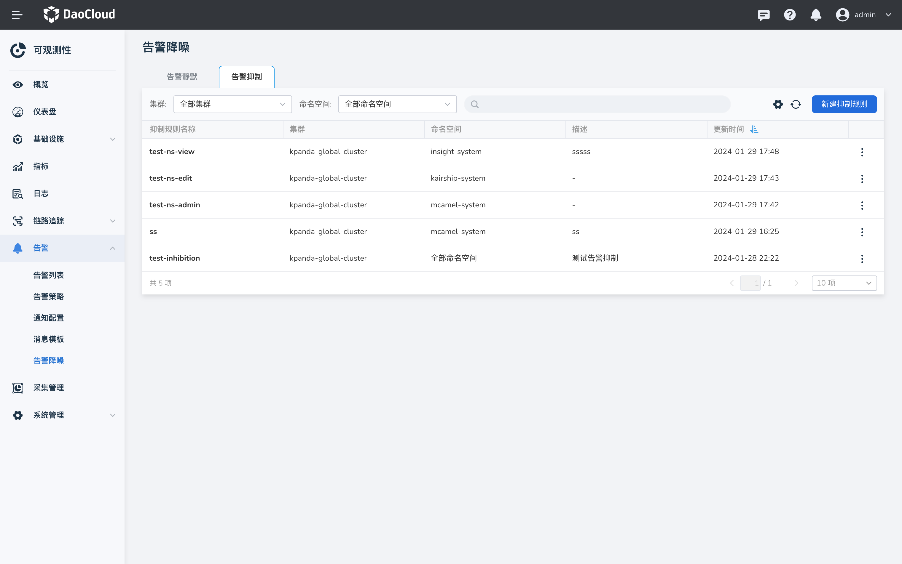
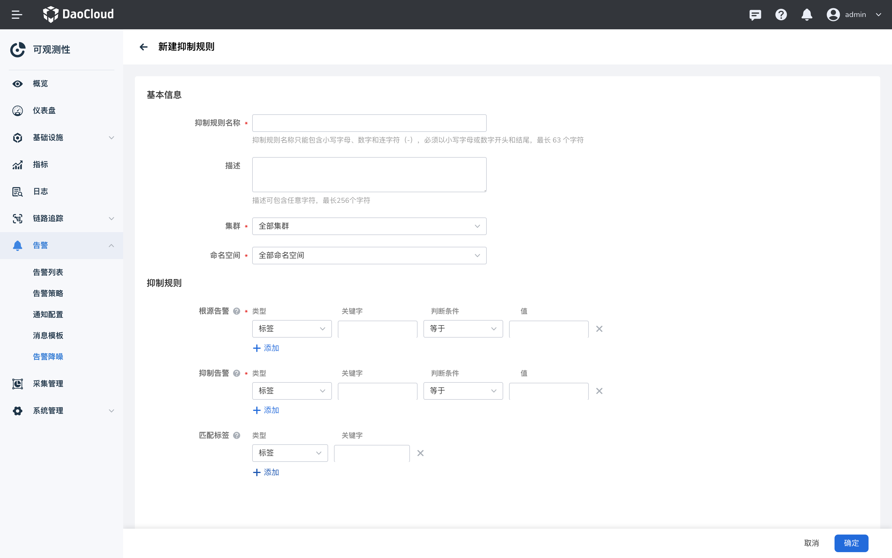
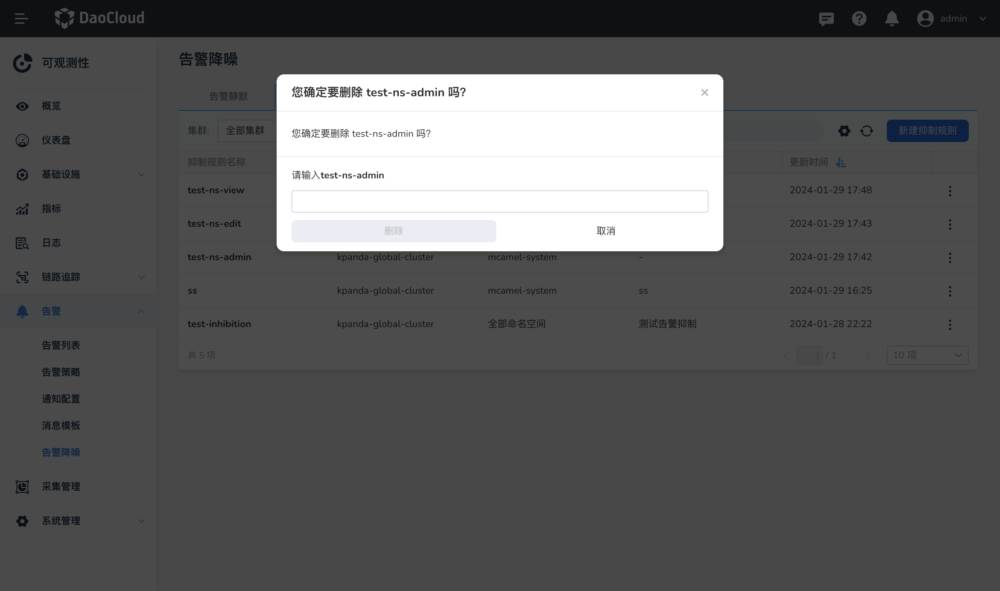

# 告警抑制

告警抑制主要是对于某些不需要立即关注的告警进行临时隐藏或者降低其优先级的一种机制。这个功能的目的是为了减少不必要的告警信息对运维人员的干扰，使他们能够集中精力处理更重要的问题。

## 创建抑制规则

1. 左侧导航栏中，选择 **告警中心** -> **告警降噪**，单击顶部的 **告警抑制** 。

    { width=1000px}

2. 点击 **新建抑制规则** ，设置抑制规则的名称、规则等。

    { width=1000px}

    | 参数时间 | 说明 |
    | ---- | ---- |
    | 抑制规则名称 | 抑制规则名称只能包含小写字母、数字和连字符（-），必须以小写字母或数字开头和结尾，最长 63 个字符。 |
    | 描述 | 描述可包含任意字符，最长 256 个字符。 |
    | 集群 | 该抑制规则作用的集群。 |
    | 命名空间 | 该抑制规则作用的命名空间。 |
    | 根源告警 | 用于指定源警报（触发抑制的警报）的匹配条件。 取值范围说明：  - 告警级别：指标或事件告警的级别，可以设置为：紧急、重要、提示。  - 资源类型：告警对象所对应的资源类型，可以设置为：集群、节点、无状态负载、有状容负载、守护进程、容器组。  - 标签：告警标识属性，由标签名和标签值构成，支持用户自定义。 |
    | 抑制告警 | 用于指定目标警报（将被抑制的警报）的匹配条件。 |
    | 匹配标签 | 用于指定应该比较的标签列表，以确定源警报和目标警报是否匹配。只有在 equal 中指定的标签在源和目标警报中的值完全相同的情况下，才会触发抑制。equal 字段是可选的。如果省略 equal 字段，则会将所有标签用于匹配 |

3. 点击**确定**完成创建后返回告警抑制列表，点击告警抑制名称后可查看抑制规则详情。

## 编辑抑制规则

点击目标规则后侧的 **⋮** ，点击 **编辑**，进入抑制规则的编辑页。

{ width=1000px}

## 删除抑制规则

点击目标规则后侧的 **⋮** ，点击 **删除**，在输入框中输入抑制规则的名称即可删除。

{ width=1000px}
