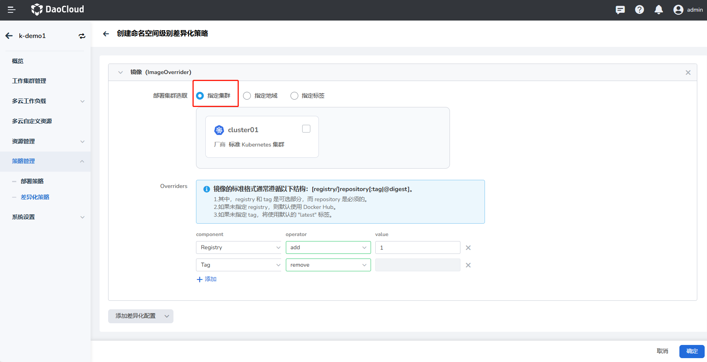
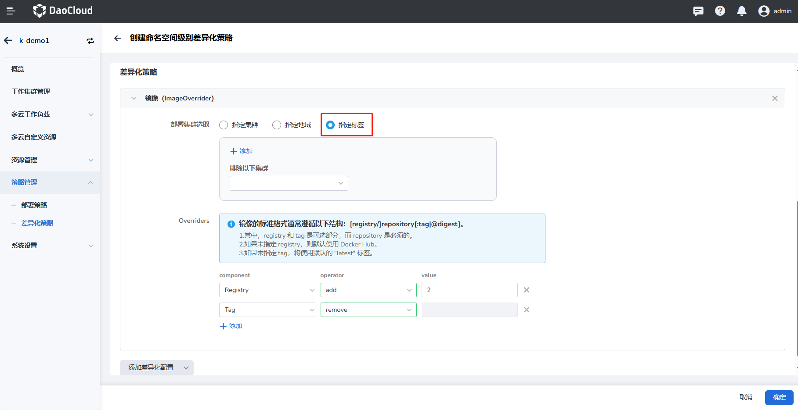

# 差异化策略

差异化策略（Override Policy）的作用是，定义在下发到不同集群中的配置，可以是不一样的，例如不同的集群所对应的镜像仓库的地址是不一样的，那就需要设置在不同集群中的工作负载的镜像地址不同，例如在不同的环境下，需要设置不同的环境变量等。差异化策略（Override Policy）的作用时机是在部署策略（Propagation Policy）之后，以及在真正在下发到集群之前。

多云编排支持差异化策略，支持在界面上查看当前实例的差异化策略列表及其关联的多云资源，并且可以通过表单和 YAML 两种方式创建和更新差异化策略的信息。差异化策略（Override Policy）分为命名空间级别和集群级别。

## YAML 创建

参照以下步骤使用 YAML 创建一个差异化策略。

1. 进入某一个多云实例后，在左侧导航栏中，点击 __策略管理__ -> __差异化策略__ ，点击 __YAML 创建__ 按钮。

    

2. 在 __YAML 创建__ 页面中，输入正确的 YAML 语句后，点击 __确定__ 。

    

3. 返回差异化策略列表，新创建的默认位于第一个。点击列表右侧的 __⋮__ ，可以编辑 YAML 和执行删除操作。

    !!! note

        若要删除一个部署策略，需要先移除该策略相关的工作负载，删除之后该策略有关的信息都将被删除，请谨慎操作。

### YAML 示例

此处列出一个差异化策略的 YAML 示例，您稍加修改就可以使用。

```yaml
kind: OverridePolicy
apiVersion: policy.karmada.io/v1alpha1
metadata:
  name: nginx-op
  namespace: default
  uid: 09f89bc4-c6bf-47b3-81bf-9e494b831aac
  resourceVersion: '856977'
  generation: 1
  creationTimestamp: '2022-09-21T10:30:40Z'
  labels:
    a: b
  annotations:
    shadow.clusterpedia.io/cluster-name: k-kairshiptest
spec:
  resourceSelectors:
    - apiVersion: apps/v1
      kind: Deployment
      namespace: default
      name: nginx
  overriders: {}
```

## 表单创建

参照以下步骤创建一个差异化策略。

1. 进入命名空间级别的菜单，点击 __创建差异化策略__ 按钮。

2. 进入表单创建页面，创建一个完整的差异化策略需要配置基础配置、资源配置、差异化策略三部分。

    - 基本配置：包括名称、多云命名空间、标签和注解。其中名称和多云命名空间为必填项。
    - 资源配置：支持选取所选多云命名空间下的多云资源进行差异化配置，多云资源也支持多选。
    - 差异化策略：支持添加镜像/运行参数/运行命令/自定义等的差异化配置。

    

3. 填写完成后点击确定则创建成功，支持对一条差异化策略进行 YAML 更新、表单更新、删除操作。

### 差异化策略详解

接下来将详细介绍差异化策略，共分为六种，且支持添加多条差异化配置：

1. 选择 ImageOverrider：镜像的差异化配置。

    1. 选择部署集群

        支持指定集群、指定地域、指定标签三种方式选取部署集群。

        === "指定集群"
        
            直接选择指定的集群名称

            

        === "指定地域"
        
            通过字段来选择集群，包括：

            - 厂商（提供集群基础设施的服务商）
            - 地域（是可用区的集合，指可以在其中托管资源的特定地理位置，例如北京、上海、深圳、成都等。）
            - 可用区（是区域内的部署区域，例如上海可用区1、上海可用区2······）
            - 还支持从已选集群中排除某指定集群。

            

        === "LabelSelector"
        
            通过标签来选择集群，支持自定义标签，同时也支持排除指定集群。

            

    2. 对选中集群进行镜像的差异化配置

        | 字段      | 必填 | 描述 | 示例 |
        | :-------- | :--- | :----- | :---- |
        | Component | 是   | 镜像组成成分 | Registry、Repository、Tag |
        | Operator  | 是   | 对镜像进行的操作 | add、remove、replace |
        | Value     | 否   | 当 Operator 为 __add__ 或 __replace__ 时不能为空，默认为空；当 operator 为 __remove__ 时不填。 |  |

2. 当选择 ArgsOverrider：运行参数的差异化配置。

    1. 选择部署集群

    2. 对选中集群进行运行参数的差异化配置

        | 字段 | 必填 | 描述 | 示例 |
        | :-- | :--- | :---- | :--- |
        | ContainerName | 是   | 容器名 | |
        | Operator      | 是   | 应用在 args 上的操作 | add、remove |
        | Value | 否   | 应用在 args 上的值，当 operator 为 __add__ 时该值 append 到 args；当 operator 为 __remove__ 时，该值从 args 移除；如果该值为空，args 维持原状。 | |

3. 当选择 CommandOverrider：运行命令的差异化配置。

    1. 选择部署集群

    2. 对选中集群进行运行命令的差异化配置

        | 字段          | 必填 | 描述 | 示例 |
        | :------------ | :--- | :----- | :------------------------------------ |
        | ContainerName | 是   | 容器名                                                       |                                       |
        | Operator      | 是   | 应用在 command 上的操作                                      | add、remove                           |
        | Value         | 否   | 应用在 command 上的值，当 operator 为 __add__ 时该值 append 到 command；当 operator 为 __remove__ 时，该值从 command 移除；如果该值为空，command 维持原状。 | 可以添加单个或多个值，多值使用 __;__ 划分 |

4. 当选择 PlainText：自定义的差异化配置。

    1. 选择部署集群

    2. 对选中集群进行运行命令的差异化配置

        | 字段     | 必填 | 描述                                                         | 示例                 |
        | :------- | :--- | :----------------------------------------------------------- | :------------------- |
        | Path     | 是   | 目标字段的路径                                               |                      |
        | Operator | 是   | 对目标字段操作类型                                           | add、remove、replace |
        | Value    | 否   | 应用在目标字段的值，当 Operator 为 __remove__ 时，此字段必须为空 |                      |

5. 当选择 LabelsOverrider：标签的差异化配置。

    

    1. 选择部署集群

    2. 对选中集群进行运行标签的差异化配置

        | 字段     | 必填 | 描述               | 示例                 |
        | :------- | :--- | :----------------- | :------------------- |
        | Key      | 是   | 标签的键           |                      |
        | Operator | 是   | 对目标字段操作类型 | add、remove、replace |
        | Value    | 否   | 标签的值           |                      |

6. 当选择 AnnotationsOverrider：注解的差异化配置。

    

    1. 选择部署集群

    2. 对选中集群进行运行注解的差异化配置

        | 字段     | 必填 | 描述               | 示例                 |
        | :------- | :--- | :----------------- | :------------------- |
        | Key      | 是   | 注解的键           |                      |
        | Operator | 是   | 对目标字段操作类型 | add、remove、replace |
        | Value    | 否   | 注解的值           |                      |
