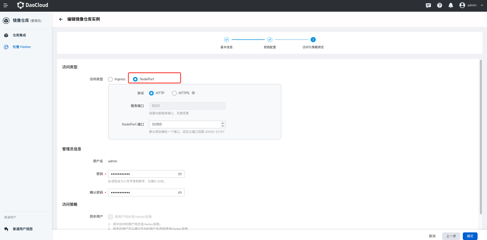
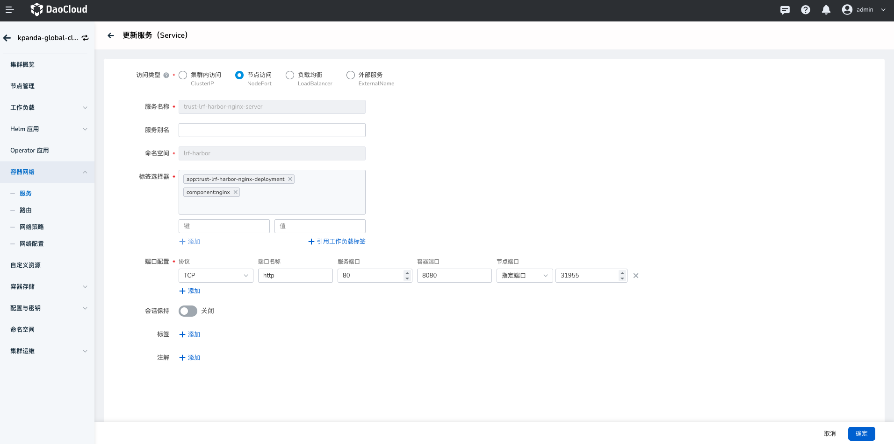

# 通过 LoadBalancer 模式部署 Harbor

现有平台不支持使用 LoadBalancer 方式部署 Harbor，仅支持使用 Ingress 和 NodePort 方式，现提供文档指导如何手工修改访问类型为 LB。

## 1、创建一个 NodePort 的 Harbor 服务。

首先参考[创建托管 Harbor](https://docs.daocloud.io/kangaroo/managed/harbor/) 创建一个访问方式为 NodePort 的 Harbor 服务



## 2、创建一个 LoadBalancer 类型的 svc 资源

在 Harbor 所在集群的 __容器网络__  -> __服务__ 创建一个LB 类型的 svc 资源。

!!! 注意

    创建 LB 类型的 svc 资源时，标签需要和 nginx svc 的 label 保持一致，且需要创建在同一个命名空间内。

Harbor服务创建成功之后，Harbor 所在集群的 __容器网络__  -> __服务__ 会自动出现 nginx 的 svc 资源。点击右侧的更新可查看 nginx 的 label 信息。





## 3、修改 harborclusters.goharbor.io CR

修改 harborclusters.goharbor.io 这个 CR 的 externalUrl 字段，改为 LB 的 IP 即可。

方式一：通过页面方式修改

1、在自定义资源列表搜索 harborclusters.goharbor.io


2、点击名称进入详情，选择 API 版本为** v1beta1<font class="text-color-1" color="#f44336"></font>**，修改完 api 版本之后保存即可。


方式二：通过命令行方式修改
```
kubectl edit harborclusters.goharbor.io
```