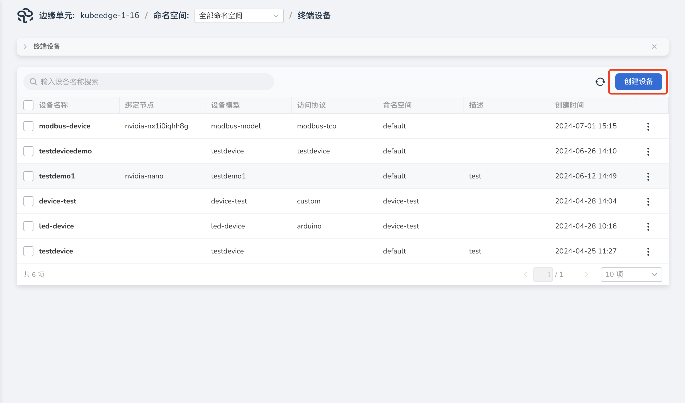
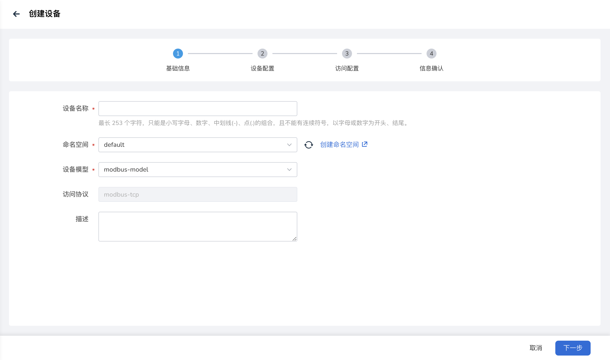
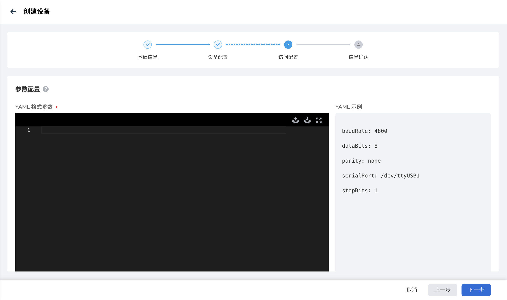
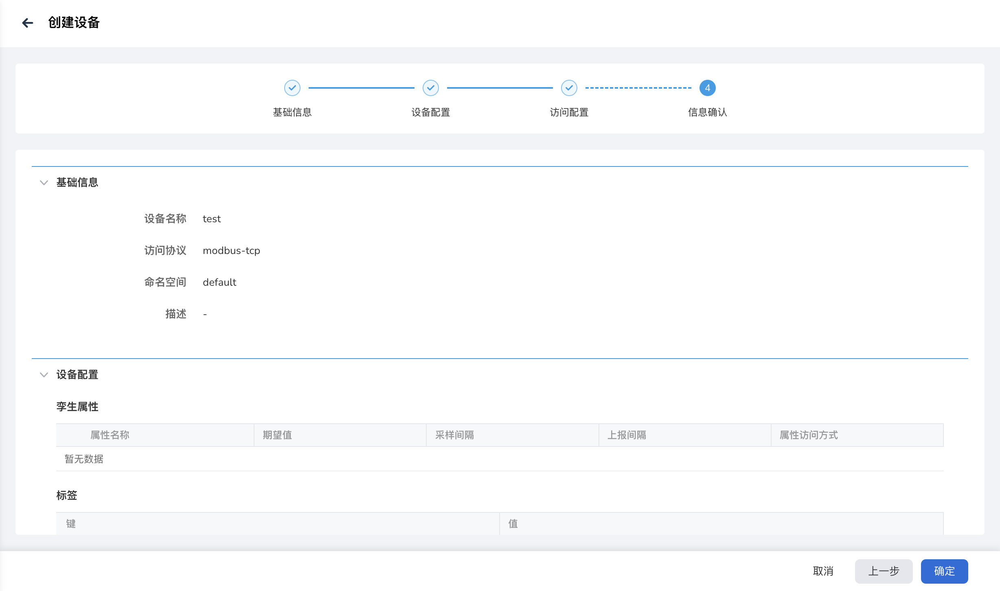

# 创建终端设备

终端设备可以连接到边缘节点，支持通过 Modbus 协议或自定义协议接入。终端设备接入后，可以在云端管理平面对设备进行统一管理。

本文介绍创建终端设备和终端设备绑定边缘节点的操作步骤。

## 创建终端设备

操作步骤如下：

1. 进入边缘单元详情页，选择左侧菜单 __边缘资源__ -> __终端设备__ 。

2. 点击终端设备列表右上角 __创建设备__ 按钮。

    

3. 填写基础信息。

    - 设备名称：小写字母、数字、中划线（-）、点（.）的组合，不能有连续符号；以字母或数字为开头、结尾；最多包含 253 个字符。
    - 命名空间：设备所在命名空间，命名空间的资源相互隔离。
    - 设备模型：设备关联的设备模型。
    - 访问协议：设备关联的设备模型访问协议会自动填入，此处不支持修改。
    - 描述：设备描述信息。

    

4. 填写设备配置，可以添加设备孪生属性和标签。

    - 孪生属性：选填，指终端设备的动态数据，包括专有实时数据，例如灯的开、关状态，温湿度传感器的温度、适度等。
    - 标签：选填，通过给设备打上标签，将不同设备进行分类管理。

    

    新增孪生属性，用户可以根据设备类型选择对应的寄存器类型，并填写对应的参数。参数说明如下：

    - 属性名：必填项，设备属性名称。
    - 期望值：选填，属性的期望值，当属性访问权限为 读/写 时可填写。 
    - 采集间隔：选填，对设备进行指定间隔的数据采集。
    - 上报间隔：选填，对设备进行指定间隔的数据上报。
    - 访问方式：平台连接到设备后，访问设备属性的方式，确保跟 mapper 属性访问方式一致。

    

5. 填写设备访问配置。

    平台连接到设备的访问参数，YAML 格式填写。

    

6. 信息确认，确认所配置的信息无误，点击 __确定__ ，完成设备创建。

    

## 终端设备绑定边缘节点

一个终端设备只能绑定一个边缘节点，设备绑定节点后，部署在节点上的应用可以通过云端创建的设备孪生获取到设备实时数据。

操作步骤如下：

1. 进入边缘单元详情页，选择左侧菜单 __边缘资源__ -> __终端设备__ 。

2. 在终端设备列表的右侧，点击 __┇__ 按钮，在弹出菜单中选择 __绑定节点__ 。

3. 在弹框中选择要绑定的节点，点击 __确定__ ，完成边缘节点的绑定。

    

下一步：[管理终端设备](manage-device.md)
