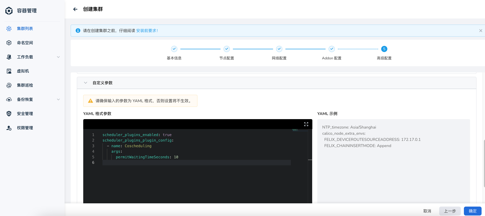
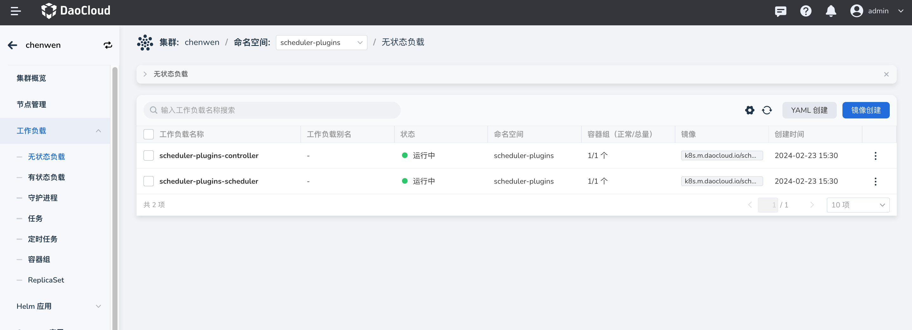
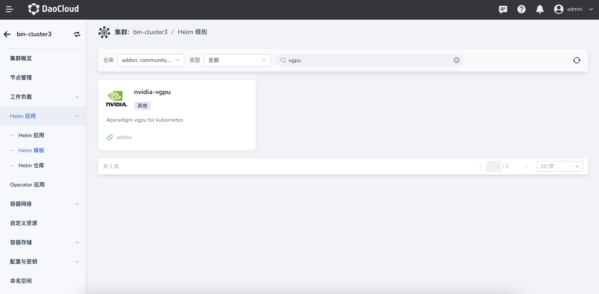
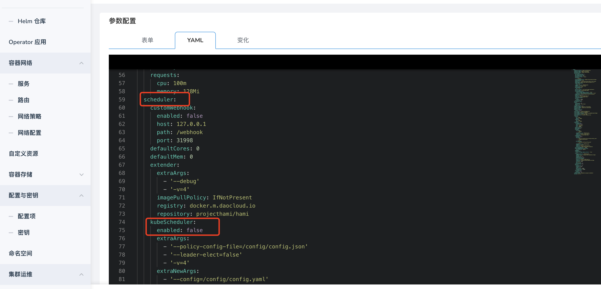

# 如何在集群中部署第二调度器 scheduler-plugins

## 为什么需要 scheduler-plugins？

通过平台创建的集群中会安装 K8s 原生的调度器，但是原生的调度器存在很多的局限性：

- 原生的调度器无法满足调度需求，你可以选择使用
  [CoScheduling](https://github.com/kubernetes-sigs/scheduler-plugins/tree/master/pkg/coscheduling)、
  [CapacityScheduling](https://github.com/kubernetes-sigs/scheduler-plugins/tree/master/pkg/capacityscheduling)
  等 scheduler-plugins 插件
- 在特殊的场景，需要新的调度器来完成调度任务而不影响原生调度器的流程
- 区分不同功能的调度器，通过切换调度器名称来实现不同的调度场景

本文以使用 vgpu 调度器的同时，想结合 scheduler-plugins 的 cosheduling 插件能力的场景为示例，介绍如何安装并使用 scheduler-plugins。

## 安装 scheduler-plugins

**前置条件**

- kubean 是在 v0.13.0 版本推出的新功能，选择管理集群时请确保版本是否 >= 此版本。
- 安装 scheduler-plugins 版本为 v0.27.8，请确保集群版本是否与它兼容。
  参考文档 [Compatibility Matrix](https://github.com/kubernetes-sigs/scheduler-plugins/tree/master?tab=readme-ov-file#compatibility-matrix)。

**安装流程**

1. 在 **创建集群** -> **高级配置** -> **自定义参数** 中添加 scheduler-plugins 参数

    ```yaml
    scheduler_plugins_enabled:true
    scheduler_plugins_plugin_config:
      - name: Coscheduling
        args:
          permitWaitingTimeSeconds: 10 # default is 60
    ```

    参数说明：
    
    - `scheduler_plugins_enabled` 设置为 true 时，开启 scheduler-plugins 插件能力。
    - 您可以通过设置 `scheduler_plugins_enabled_plugins` 或 `scheduler_plugins_disabled_plugins` 选项来启用或禁用某些插件。
      参阅 [K8s 官方插件名称](https://github.com/kubernetes-sigs/scheduler-plugins?tab=readme-ov-file#plugins)。
    - 如果需要设置自定义插件的参数请配置 scheduler_plugins_plugin_config，例如：设置 coscheduling 的 permitWaitingTimeoutSeconds 参数。
      参阅 [K8s 官方插件配置项](https://github.com/kubernetes-sigs/scheduler-plugins/blob/master/manifests/coscheduling/scheduler-config.yaml)

    

2. 集群创建成功后系统会自动安装 scheduler-plugins 和 controller 组件负载，可以在对应集群的无状态负载中查看负载状态。

    

## 使用 scheduler-plugins

以下以使用 vgpu 调度器的同时，想结合 scheduler-plugins 的 cosheduling 插件能力场景为示例，介绍如何使用 scheduler-plugins。

1. 在 Helm 模板中安装 vgpu，设置 values.yaml 参数。

    - `schedulerName: scheduler-plugins-scheduler`，这是 kubean 默认安装的 scheduler-plugins 的 scheduler 名称，目前不能修改。
    - `scheduler.kubeScheduler.enabled: false`，不安装 kube-scheduler，将 vgpu-scheduler 作为单独的 extender。

    
    

1. 在 scheduler-plugins 上扩展 vgpu-scheduler。

    ```bash
    [root@master01 charts]# kubectl get cm -n scheduler-plugins scheduler-config -ojsonpath="{.data.scheduler-config\.yaml}"
    ```
    ```yaml
    apiVersion: kubescheduler.config.k8s.io/v1
    kind: KubeSchedulerConfiguration
    leaderElection:
    leaderElect: false
    profiles:
    # Compose all plugins in one profile
    - schedulerName: scheduler-plugins-scheduler
    plugins:
        multiPoint:
        enabled:
        - name: Coscheduling
        - name: CapacityScheduling
        - name: NodeResourceTopologyMatch
        - name: NodeResourcesAllocatable
        disabled:
        - name: PrioritySort
    pluginConfig:
    - args:
        permitWaitingTimeSeconds: 10
        name: Coscheduling
    ```

    修改 scheduler-plugins 的 scheduler-config 的 cofigmap 参数，如下：

    ```bash
    [root@master01 charts]# kubectl get cm -n scheduler-plugins scheduler-config -ojsonpath="{.data.scheduler-config\.yaml}"
    ```
    ```yaml
    apiVersion: kubescheduler.config.k8s.io/v1
    kind: KubeSchedulerConfiguration
    leaderElection:
    leaderElect: false
    profiles:
    # Compose all plugins in one profile
    - schedulerName: scheduler-plugins-scheduler
    plugins:
        multiPoint:
        enabled:
        - name: Coscheduling
        - name: CapacityScheduling
        - name: NodeResourceTopologyMatch
        - name: NodeResourcesAllocatable
        disabled:
        - name: PrioritySort
    pluginConfig:
    - args:
        permitWaitingTimeSeconds: 10
        name: Coscheduling
    extenders:
    - urlPrefix: "${urlPrefix}"
      filterVerb: filter
      bindVerb: bind
      nodeCacheCapable: true
      ignorable: true
      httpTimeout: 30s
      weight: 1
      enableHTTPS: true
      tlsConfig:
        insecure: true
      managedResources:
      - name: nvidia.com/vgpu
        ignoredByScheduler: true
      - name: nvidia.com/gpumem
        ignoredByScheduler: true
      - name: nvidia.com/gpucores
        ignoredByScheduler: true
      - name: nvidia.com/gpumem-percentage
        ignoredByScheduler: true
      - name: nvidia.com/priority
        ignoredByScheduler: true
      - name: cambricon.com/mlunum
        ignoredByScheduler: true
    ```

1. 安装完 vgpu-scheduler 后，系统会自动创建 svc，urlPrefix 指定 svc 的 url。

    !!! note

        - svc 指 pod 服务负载，您可以到安装了 nvidia-vgpu 插件的命名空间下通过以下命令拿到 443 端口对应的外部访问信息。

            ```shell
            kubectl get svc -n ${namespace} 
            ```

        - urlprifix 格式为 https://${ip 地址}:${端口}


1. 将 scheduler-plugins 的 scheduler Pod 重启，加载新的配置文件。

    !!! note

        在创建 vgpu 应用时不需要指定调度器名称，vgpu-scheduler 的 Webhook 会自动将 Scheduler 的名称修改为 scheduler-plugins-scheduler，不用手动指定。
