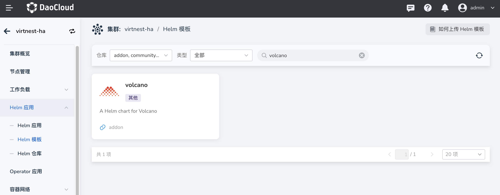
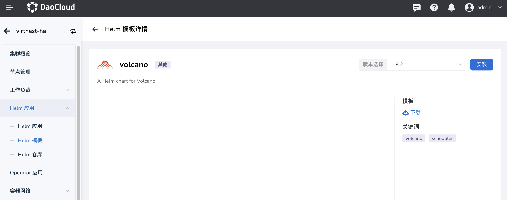
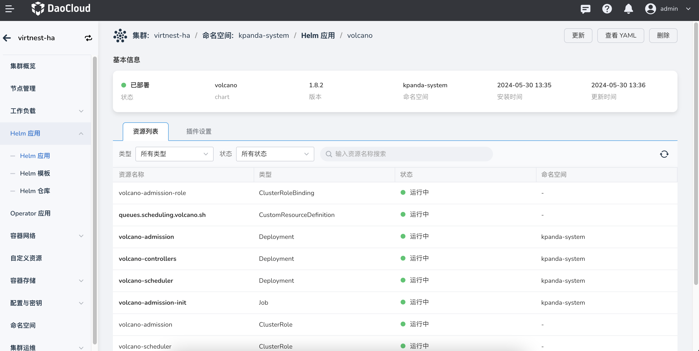

# 使用 Volcano 轻松完成 AI 计算

# 使用场景

Kubernetes已经成为云原生应用编排、管理的事实标准， 越来越多的应用选择向K8s迁移。人工智能和机器学习领域天然的包含大量的计算密集型任务，开发者非常愿意基于Kubernetes构建AI平台，充分利用Kubernetes提供的资源管理、应用编排、运维监控能力。而Kubernetes 默认调度器最初主要是为长服务设计的，对于AI、大数据等批量和弹性调度方面还有很多的不足。比如资源争抢问题：

以 TensorFlow 的作业场景为例，TensorFlow 的作业包含 PS 和 Worker 两种不同的角色，这两种角色的 Pod要配合起来完成整个作业，如果只是运行一种角色 Pod，整个作业是无法正常执行的，而默认调度器对于 Pod调度是一个一个进行的，对于 Kubeflow 作业 TFJob 的 PS 和 Worker 是不感知的。在集群高负载（资源不足）的情况下，会出现多个作业各自分配到部分资源运行一部分 Pod，而又无法正执行完成的状况，从而造成资源浪费。如集群有4块 GPU卡，TFJob1 和 TFJob2 作业各自有4个 Worker，TFJob1 和TFJob2 各自分配到 2个GPU。但是 TFJob1 和 TFJob2 均需要4块 GPU 卡才能运行起来。这样 TFJob1 和 TFJob2 处于互相等待对方释放资源，这种死锁情况造成了 GPU 资源的浪费。

# Volcano 批量调度系统

Volcano 是 CNCF 下首个基于 Kubernetes 的容器批处理计算平台，专注于高性能计算场景。 它填补了 Kubernetes 在机器学习、大数据、科学计算等领域缺失的功能，为这些高性能工作负载提供了必要的支持。同时，Volcano 与主流计算框架无缝对接，如 Spark、TensorFlow、PyTorch 等，并支持异构设备的混合调度，包括 CPU 和 GPU，能够有效解决上述场景中出现的死锁问题。

下面介绍如何安装和使用 Volcano。

## 安装 Volcano

1. 在 **集群详情** -> **Helm 应用** -> **Helm 模板** 中找到 Volcano 并安装。

    
   
    

2. 检查并确认 Volcano 是否安装完成，即 volcano-admission、volcano-controllers、volcano-scheduler 组件是否正常运行。

    

通常 Volcano 会和[** 智能算力平台 **](https://docs.daocloud.io/baize/developer/quick-start.html)配合使用，以实现数据集、Notebook、任务训练的整个开发、训练流程的有效闭环。

## Volcano 使用案例

- Volcano 是单独的调度器，在创建工作负载的时候指定调度器的名称（schedulerName: volcano）即可启用Volcano调度器。
- volcanoJob 资源是 Volcano 对 Job 的扩展，它将 job 拆分成更小的工作单位 task，这些 task 之间可以相互作用。

### Volcano 支持 TensorFlow

使用示例：

Volcano 原生支持 tensorflow 的调度作业，通过简单的设置schedulerName字段的值为“volcano”，启用Volcano调度器。

```yaml
apiVersion: batch.volcano.sh/v1alpha1
kind: Job
metadata:
  name: tensorflow-benchmark
  labels:
    "volcano.sh/job-type": "Tensorflow" # (1)!
spec:
  minAvailable: 3
  schedulerName: volcano
  plugins:
    env: []
    svc: []
  policies:
    - event: PodEvicted
      action: RestartJob
  tasks:
    - replicas: 1
      name: ps
      template:
        spec:
          imagePullSecrets:
            - name: default-secret
          containers:
            - command:
                - sh
                - -c
                - |
                  PS_HOST=`cat /etc/volcano/ps.host | sed 's/$/&:2222/g' | tr "\n" ","`;
                  WORKER_HOST=`cat /etc/volcano/worker.host | sed 's/$/&:2222/g' | tr "\n" ","`;
                  python tf_cnn_benchmarks.py --batch_size=32 --model=resnet50 --variable_update=parameter_server --flush_stdout=true --num_gpus=1 --local_parameter_device=cpu --device=cpu --data_format=NHWC --job_name=ps --task_index=${VK_TASK_INDEX} --ps_hosts=${PS_HOST} --worker_hosts=${WORKER_HOST}
              image: docker.m.daocloud.io/volcanosh/example-tf:0.0.1
              name: tensorflow
              ports:
                - containerPort: 2222
                  name: tfjob-port
              resources:
                requests:
                  cpu: "1000m"
                  memory: "2048Mi"
                limits:
                  cpu: "1000m"
                  memory: "2048Mi"
              workingDir: /opt/tf-benchmarks/scripts/tf_cnn_benchmarks
          restartPolicy: OnFailure
    - replicas: 2
      name: worker
      policies:
        - event: TaskCompleted
          action: CompleteJob
      template:
        spec:
          imagePullSecrets:
            - name: default-secret
          containers:
            - command:
                - sh
                - -c
                - |
                  PS_HOST=`cat /etc/volcano/ps.host | sed 's/$/&:2222/g' | tr "\n" ","`;
                  WORKER_HOST=`cat /etc/volcano/worker.host | sed 's/$/&:2222/g' | tr "\n" ","`;
                  python tf_cnn_benchmarks.py --batch_size=32 --model=resnet50 --variable_update=parameter_server --flush_stdout=true --num_gpus=1 --local_parameter_device=cpu --device=cpu --data_format=NHWC --job_name=worker --task_index=${VK_TASK_INDEX} --ps_hosts=${PS_HOST} --worker_hosts=${WORKER_HOST}
              image: docker.m.daocloud.io/volcanosh/example-tf:0.0.1
              name: tensorflow
              ports:
                - containerPort: 2222
                  name: tfjob-port
              resources:
                requests:
                  cpu: "2000m"
                  memory: "2048Mi"
                limits:
                  cpu: "2000m"
                  memory: "4096Mi"
              workingDir: /opt/tf-benchmarks/scripts/tf_cnn_benchmarks
          restartPolicy: OnFailure
```

### 并行计算 mpi

在 MPI 计算框架下的多线程并行计算通信场景中，我们要确保所有的 Pod 都能调度成功才能保证任务正常完成。 设置 minAvailable 为 4，表示要求 1 个 mpimaster 和 3 个 mpiworker 能运行。通过简单的设置schedulerName字段的值为“volcano”，启用Volcano调度器。

使用示例：

```yaml
apiVersion: batch.volcano.sh/v1alpha1
kind: Job
metadata:
  name: lm-mpi-job
  labels:
    "volcano.sh/job-type": "MPI"
spec:
  minAvailable: 4
  schedulerName: volcano
  plugins:
    ssh: []
    svc: []
  policies:
    - event: PodEvicted
      action: RestartJob
  tasks:
    - replicas: 1
      name: mpimaster
      policies:
        - event: TaskCompleted
          action: CompleteJob
      template:
        spec:
          containers:
            - command:
                - /bin/sh
                - -c
                - |
                  MPI_HOST=`cat /etc/volcano/mpiworker.host | tr "\n" ","`;
                  mkdir -p /var/run/sshd; /usr/sbin/sshd;
                  mpiexec --allow-run-as-root --host ${MPI_HOST} -np 3 mpi_hello_world;
              image: docker.m.daocloud.io/volcanosh/example-mpi:0.0.1
              name: mpimaster
              ports:
                - containerPort: 22
                  name: mpijob-port
              workingDir: /home
              resources:
                requests:
                  cpu: "500m"
                limits:
                  cpu: "500m"
          restartPolicy: OnFailure
          imagePullSecrets:
            - name: default-secret
    - replicas: 3
      name: mpiworker
      template:
        spec:
          containers:
            - command:
                - /bin/sh
                - -c
                - |
                  mkdir -p /var/run/sshd; /usr/sbin/sshd -D;
              image: docker.m.daocloud.io/volcanosh/example-mpi:0.0.1
              name: mpiworker
              ports:
                - containerPort: 22
                  name: mpijob-port
              workingDir: /home
              resources:
                requests:
                  cpu: "1000m"
                limits:
                  cpu: "1000m"
          restartPolicy: OnFailure
          imagePullSecrets:
            - name: default-secret
```

生成 PodGroup 的资源：

```yaml
apiVersion: scheduling.volcano.sh/v1beta1
kind: PodGroup
metadata:
  annotations:
  creationTimestamp: "2024-05-28T09:18:50Z"
  generation: 5
  labels:
    volcano.sh/job-type: MPI
  name: lm-mpi-job-9c571015-37c7-4a1a-9604-eaa2248613f2
  namespace: default
  ownerReferences:
  - apiVersion: batch.volcano.sh/v1alpha1
    blockOwnerDeletion: true
    controller: true
    kind: Job
    name: lm-mpi-job
    uid: 9c571015-37c7-4a1a-9604-eaa2248613f2
  resourceVersion: "25173454"
  uid: 7b04632e-7cff-4884-8e9a-035b7649d33b
spec:
  minMember: 4
  minResources:
    count/pods: "4"
    cpu: 3500m
    limits.cpu: 3500m
    pods: "4"
    requests.cpu: 3500m
  minTaskMember:
    mpimaster: 1
    mpiworker: 3
  queue: default
status:
  conditions:
  - lastTransitionTime: "2024-05-28T09:19:01Z"
    message: '3/4 tasks in gang unschedulable: pod group is not ready, 1 Succeeded,
      3 Releasing, 4 minAvailable'
    reason: NotEnoughResources
    status: "True"
    transitionID: f875efa5-0358-4363-9300-06cebc0e7466
    type: Unschedulable
  - lastTransitionTime: "2024-05-28T09:18:53Z"
    reason: tasks in gang are ready to be scheduled
    status: "True"
    transitionID: 5a7708c8-7d42-4c33-9d97-0581f7c06dab
    type: Scheduled
  phase: Pending
  succeeded: 1
```
从 PodGroup 可以看出，通过 ownerReferences 关联到工作负载，并设置最小运行的 Pod 数为 4。

如果您想了解 Volcano 更多功能特性和使用场景，可以参考 [Volcano 介绍](https://volcano.sh/zh/docs/)。