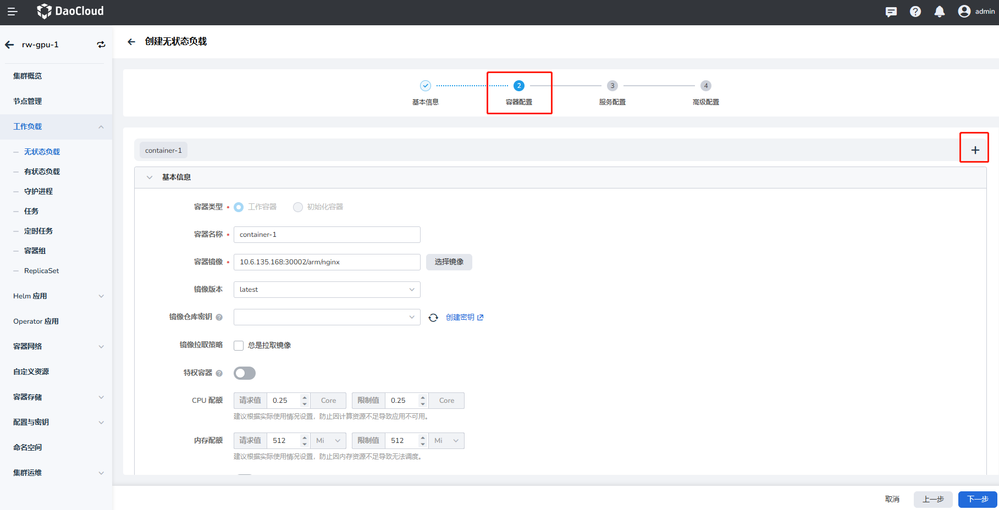
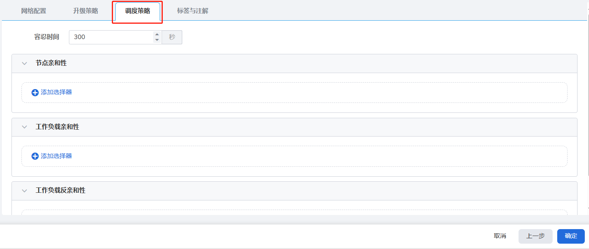
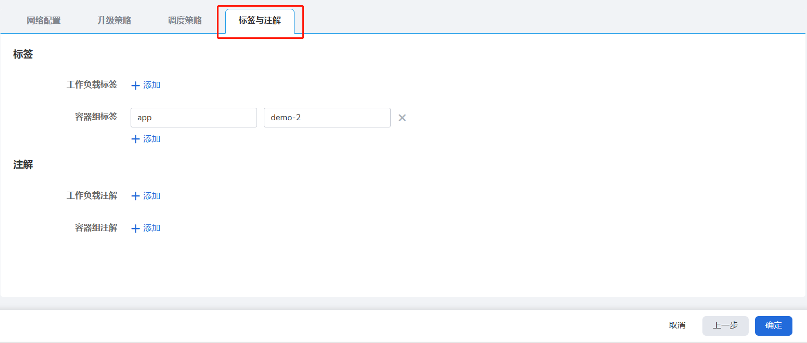

# 创建无状态负载（Deployment）

本文介绍如何通过镜像和 YAML 文件两种方式创建无状态负载。

[无状态负载（Deployment）](https://kubernetes.io/zh-cn/docs/concepts/workloads/controllers/deployment/)是 Kubernetes 中的一种常见资源，主要为 [Pod](https://kubernetes.io/zh-cn/docs/concepts/workloads/pods/) 和 [ReplicaSet](https://kubernetes.io/zh-cn/docs/concepts/workloads/controllers/replicaset/) 提供声明式更新，支持弹性伸缩、滚动升级、版本回退等功能。在 Deployment 中声明期望的 Pod 状态，Deployment Controller 会通过 ReplicaSet 修改当前状态，使其达到预先声明的期望状态。Deployment 是无状态的，不支持数据持久化，适用于部署无状态的、不需要保存数据、随时可以重启回滚的应用。

通过 [DCE 5.0](../../../dce/index.md) 的容器管理模块，可以基于相应的角色权限轻松管理多云多集群上的工作负载，包括对无状态负载的创建、更新、删除、弹性扩缩、重启、版本回退等全生命周期管理。

## 前提条件

在使用镜像创建无状态负载之前，需要满足以下前提条件：

- 在[容器管理](../../intro/index.md)模块中[接入 Kubernetes 集群](../clusters/integrate-cluster.md)或者[创建 Kubernetes 集群](../clusters/create-cluster.md)，且能够访问集群的 UI 界面。

- 创建一个[命名空间](../namespaces/createns.md)和[用户](../../../ghippo/user-guide/access-control/user.md)。

- 当前操作用户应具有 [NS Editor](../permissions/permission-brief.md#ns-editor) 或更高权限，详情可参考[命名空间授权](../namespaces/createns.md)。

- 单个实例中有多个容器时，请确保容器使用的端口不冲突，否则部署会失效。

## 镜像创建

参考以下步骤，使用镜像创建一个无状态负载。

1. 点击左侧导航栏上的 __集群列表__ ，然后点击目标集群的名称，进入 __集群详情__ 页面。

    

2. 在集群详情页面，点击左侧导航栏的 __工作负载__ -> __无状态负载__ ，然后点击页面右上角的 __镜像创建__ 按钮。

    

3. 依次填写[基本信息](create-deployment.md#_3)、[容器配置](create-deployment.md#_4)、[服务配置](create-deployment.md#_5)、[高级配置](create-deployment.md#_6)后，在页面右下角点击 __确定__ 完成创建。

    系统将自动返回 __无状态负载__ 列表。点击列表右侧的 __︙__ ，可以对负载执行执行更新、删除、弹性扩缩、重启、版本回退等操作。如果负载状态出现异常，请查看具体异常信息，可参考[工作负载状态](../workloads/pod-config/workload-status.md)。

    

### 基本信息

- 负载名称：最多包含 63 个字符，只能包含小写字母、数字及分隔符（“-”），且必须以小写字母或数字开头及结尾，例如 deployment-01。同一命名空间内同一类型工作负载的名称不得重复，而且负载名称在工作负载创建好之后不可更改。
- 命名空间：选择将新建的负载部署在哪个命名空间，默认使用 default 命名空间。找不到所需的命名空间时可以根据页面提示去[创建新的命名空间](../namespaces/createns.md)。
- 实例数：输入负载的 Pod 实例数量，默认创建 1 个 Pod 实例。
- 描述：输入负载的描述信息，内容自定义。字符数不超过 512。

    

### 容器配置

容器配置分为基本信息、生命周期、健康检查、环境变量、数据存储、安全设置六部分，点击下方的相应页签可查看各部分的配置要求。

> 容器配置仅针对单个容器进行配置，如需在一个容器组中添加多个容器，可点击右侧的 __+__ 添加多个容器。

=== "基本信息（必填）"

    在配置容器相关参数时，必须正确填写容器的名称、镜像参数，否则将无法进入下一步。参考以下要求填写配置后，点击 __确认__ 。

    
    
    - 容器类型：默认为`工作容器`。有关初始化容器，参见 [k8s 官方文档](https://kubernetes.io/zh-cn/docs/concepts/workloads/pods/init-containers/)。
    - 容器名称：最多包含 63 个字符，支持小写字母、数字及分隔符（“-”）。必须以小写字母或数字开头及结尾，例如 nginx-01。
    - 镜像：
        - 容器镜像：从列表中选择一个合适的镜像。输入镜像名称时，默认从官方的 [DockerHub](https://hub.docker.com/) 拉取镜像。
          接入 DCE 5.0 的[镜像仓库](../../../kangaroo/intro/index.md)模块后，可以点击右侧的 __选择镜像__ 按钮来选择镜像。
        - 镜像版本：从下拉列表选择一个合适的版本。
        - 镜像拉取策略：勾选 __总是拉取镜像__ 后，负载每次重启/升级时都会从仓库重新拉取镜像。
          如果不勾选，则只拉取本地镜像，只有当镜像在本地不存在时才从镜像仓库重新拉取。
          更多详情可参考[镜像拉取策略](https://kubernetes.io/zh-cn/docs/concepts/containers/images/#image-pull-policy)。
        - 镜像仓库密钥：可选。如果目标仓库需要 Secret 才能访问，需要先去[创建一个密钥](../configmaps-secrets/create-secret.md)。
    - 特权容器：容器默认不可以访问宿主机上的任何设备，开启特权容器后，容器即可访问宿主机上的所有设备，享有宿主机上的运行进程的所有权限。
    - CPU/内存配额：CPU/内存资源的请求值（需要使用的最小资源）和限制值（允许使用的最大资源）。请根据需要为容器配置资源，避免资源浪费和因容器资源超额导致系统故障。默认值如图所示。
    - GPU 配置：为容器配置 GPU 用量，仅支持输入正整数。GPU 配额设置支持为容器设置独享整张 GPU 卡或部分 vGPU。
      例如，对于一张 8 核心的 GPU 卡，输入数字 __8__ 表示让容器独享整长卡，输入数字 __1__ 表示为容器配置 1 核心的 vGPU。
    
    > 设置 GPU 之前，需要管理员预先在集群节点上安装 GPU 卡及驱动插件，并在[集群设置](../clusterops/cluster-settings.md)中开启 GPU 特性。

=== "生命周期（选填）"

    设置容器启动时、启动后、停止前需要执行的命令。详情可参考[容器生命周期配置](pod-config/lifecycle.md)。
    
    

=== "健康检查（选填）"

    用于判断容器和应用的健康状态，有助于提高应用的可用性。详情可参考[容器健康检查配置](pod-config/health-check.md)。
    
    

=== "环境变量（选填）"

    配置 Pod 内的容器参数，为 Pod 添加环境变量或传递配置等。详情可参考[容器环境变量配置](pod-config/env-variables.md)。
    
    

=== "数据存储（选填）"

    配置容器挂载数据卷和数据持久化的设置。详情可参考[容器数据存储配置](pod-config/env-variables.md)。
    
    

=== "安全设置（选填）"

    通过 Linux 内置的账号权限隔离机制来对容器进行安全隔离。您可以通过使用不同权限的账号 UID（数字身份标记）来限制容器的权限。例如，输入 __0__ 表示使用 root 账号的权限。
    
    

### 服务配置

为无状态负载配置[服务（Service）](../network/create-services.md)，使无状态负载能够被外部访问。

1. 点击 __创建服务__ 按钮。

    

2. 参考[创建服务](../network/create-services.md)，配置服务参数。

    

3. 点击 __确定__ ，点击 __下一步__ 。

### 高级配置

高级配置包括负载的网络配置、升级策略、调度策略、标签与注解四部分，可点击下方的页签查看各部分的配置要求。

=== "网络配置"

    - 如在集群中部署了 [SpiderPool](../../../network/modules/spiderpool/index.md) 和 [Multus](../../../network/modules/multus-underlay/index.md) 组件，则可以在网络配置中配置容器网卡。详情参考[工作负载使用 IP 池](../../../network/config/use-ippool/usage.md)。
    
    - DNS 配置：应用在某些场景下会出现冗余的 DNS 查询。Kubernetes 为应用提供了与 DNS 相关的配置选项，能够在某些场景下有效地减少冗余的 DNS 查询，提升业务并发量。
    
    - DNS 策略
    
        - Default：使容器使用 kubelet 的 __--resolv-conf__ 参数指向的域名解析文件。该配置只能解析注册到互联网上的外部域名，无法解析集群内部域名，且不存在无效的 DNS 查询。
        - ClusterFirstWithHostNet：应用对接主机的域名文件。
        - ClusterFirst：应用对接 Kube-DNS/CoreDNS。
        - None：Kubernetes v1.9（Beta in v1.10）中引入的新选项值。设置为 None 之后，必须设置 dnsConfig，此时容器的域名解析文件将完全通过 dnsConfig 的配置来生成。
    
    - 域名服务器：填写域名服务器的地址，例如 __10.6.175.20__ 。
    - 搜索域：域名查询时的 DNS 搜索域列表。指定后，提供的搜索域列表将合并到基于 dnsPolicy 生成的域名解析文件的 search 字段中，并删除重复的域名。Kubernetes 最多允许 6 个搜索域。
    - Options：DNS 的配置选项，其中每个对象可以具有 name 属性（必需）和 value 属性（可选）。该字段中的内容将合并到基于 dnsPolicy 生成的域名解析文件的 options 字段中，dnsConfig 的 options 的某些选项如果与基于 dnsPolicy 生成的域名解析文件的选项冲突，则会被 dnsConfig 所覆盖。
    - 主机别名：为主机设置的别名。

        

=== "升级策略"

    - 升级方式： __滚动升级__ 指逐步用新版本的实例替换旧版本的实例，升级的过程中，业务流量会同时负载均衡分布到新老的实例上，因此业务不会中断。 __重建升级__ 指先删除老版本的负载实例，再安装指定的新版本，升级过程中业务会中断。
    - 最大不可用：指定负载更新过程中不可用 Pod 的最大值或比率，默认 25%。如果等于实例数有服务中断的风险。
    - 最大峰值：更新 Pod 的过程中 Pod 总数超过 Pod 期望副本数部分的最大值或比率。默认 25%。
    - 最大保留版本数：设置版本回滚时保留的旧版本数量。默认 10。
    - Pod 可用最短时间：Pod 就绪的最短时间，只有超出这个时间 Pod 才被认为可用，默认 0 秒。
    - 升级最大持续时间：如果超过所设置的时间仍未部署成功，则将该负载标记为失败。默认 600 秒。
    - 缩容时间窗：负载停止前命令的执行时间窗（0-9,999秒），默认 30 秒。

        

=== "调度策略"

    - 容忍时间：负载实例所在的节点不可用时，将负载实例重新调度到其它可用节点的时间，默认为 300 秒。
    - 节点亲和性：根据节点上的标签来约束 Pod 可以调度到哪些节点上。
    - 工作负载亲和性：基于已经在节点上运行的 Pod 的标签来约束 Pod 可以调度到哪些节点。
    - 工作负载反亲和性：基于已经在节点上运行的 Pod 的标签来约束 Pod 不可以调度到哪些节点。
    
    > 具体详情请参考[调度策略](pod-config/scheduling-policy.md)。

    

=== "标签与注解"

    可以点击 __添加__ 按钮为工作负载和容器组添加标签和注解。
    
    

## YAML 创建

除了通过镜像方式外，还可以通过 YAML 文件更快速地创建创建无状态负载。

1. 点击左侧导航栏上的 __集群列表__ ，然后点击目标集群的名称，进入 __集群详情__ 页面。

    

2. 在集群详情页面，点击左侧导航栏的 __工作负载__ -> __无状态负载__ ，然后点击页面右上角的 __YAML 创建__ 按钮。

    

3. 输入或粘贴事先准备好的 YAML 文件，点击 __确定__ 即可完成创建。

    

??? note "点击查看创建无状态负载的 YAML 示例"

    ```yaml
    apiVersion: apps/v1
    kind: Deployment
    metadata:
      name: nginx-deployment
    spec:
      selector:
        matchLabels:
          app: nginx
      replicas: 2 # 告知 Deployment 运行 2 个与该模板匹配的 Pod
      template:
        metadata:
          labels:
            app: nginx
        spec:
          containers:
          - name: nginx
            image: nginx:1.14.2
            ports:
            - containerPort: 80
    ```
