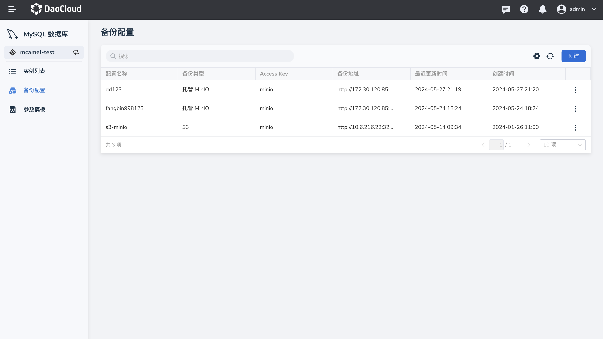
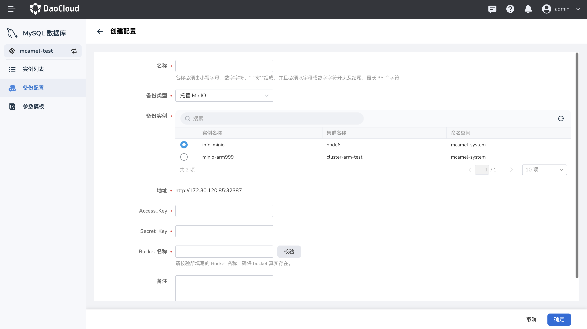
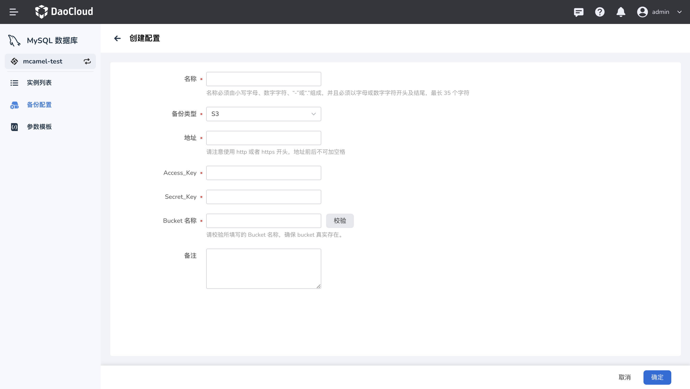
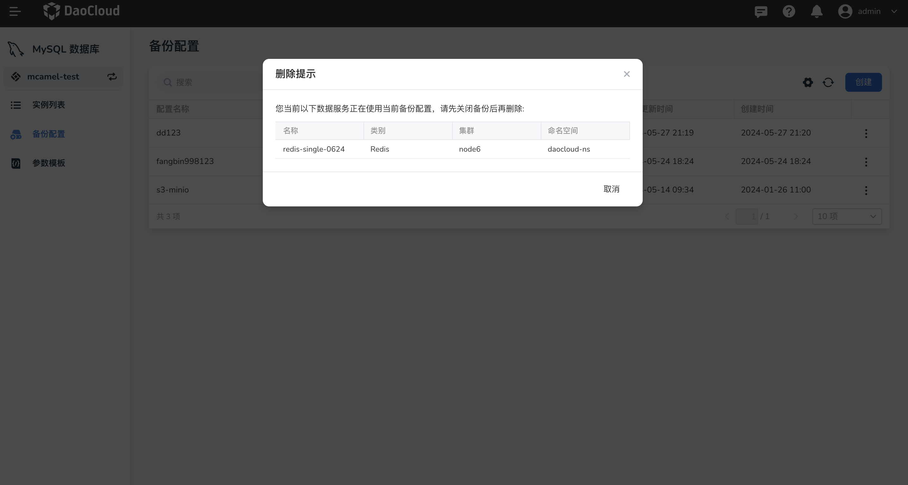

# 备份配置

DCE 数据服务提供的 MySQL 支持对数据库进行备份和恢复，以保证数据的安全性。在工作空间中，工作空间管理员可以统一管理 MySQL 数据备份的存储配置。

## 操作步骤

### 创建备份配置

1. 点击导航栏进入`MySQL 数据库`；
2. 点击 MySQL 数据库导航栏中 `备份配置`，点击列表中的 `创建` 按钮；

    

3. 选择备份配置的类型。

    - 使用 DCE 数据服务中提供的 MinIO 实例时，选中需要备份数据的 MinIO 实例，系统会自动获取所选 MinIO 的地址，用户需要填写所选 MinIO 实例的 Access_Key，Secret_Key，Bucket 名称。请确保 MinIO 中已存在填写的 Bucket。

    - 使用其他 S3 对象存储：填写要使用的 S3 的访问地址，Access_Key，Secret_Key 以及 Bucket 名称。

    

    

4. 填写并校验完成后，点击`确认`后返回备份配置列表，即可查看创建成功的存储信息。

### 编辑备份配置

进入备份配置列表，点击想要编辑的对象存储最后一列的 `… > 更新`，对其进行修改。

### 删除备份配置

1. 进入备份配置列表，点击想要编辑的对象存储最后一列的 `… > 删除`。

- 若工作空间中的中间件实例正在使用所选的对象存储实例，则不允许被删除。

    
