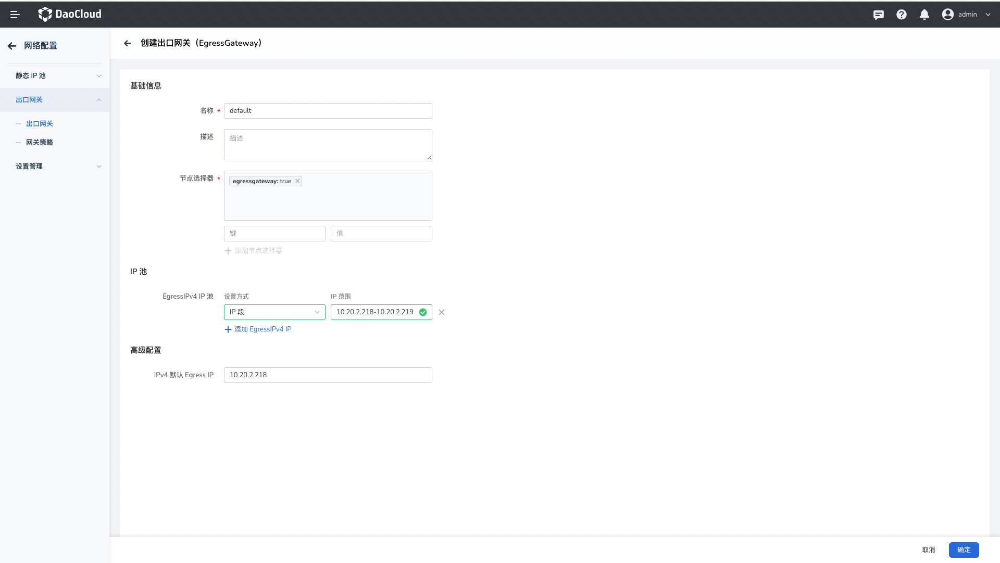

# 创建 EgressGateway 实例

本页介绍创建 EgressGateway 实例的步骤。

## 前提条件

1. 目前 EgressGateway 支持如下 CNI：

    ===  "Calico"

        如果您的集群使用 [Calico](https://www.tigera.io/project-calico/) CNI，请执行如下命令，
        该命令确保 EgressGateway 的 iptables 规则不会被 Calico 规则覆盖，否则 EgressGateway 将不能工作。

        ```shell
        # set chainInsertMode
        $ kubectl patch felixconfigurations  default --type='merge' -p '{"spec":{"chainInsertMode":"Append"}}'
        
        # check status
        $ kubectl get FelixConfiguration default -o yaml
        apiVersion: crd.projectcalico.org/v1
        kind: FelixConfiguration
        metadata:
          generation: 2
          name: default
          resourceVersion: "873"
          uid: 0548a2a5-f771-455b-86f7-27e07fb8223d
        spec:
          chainInsertMode: Append
        ......
        ```

        !!! tip

            __spec.chainInsertMode__ 的意义可参考 [Calico 文档](https://projectcalico.docs.tigera.io/reference/resources/felixconfig)。

    ===  "Flannel"

        [Flannel](https://github.com/flannel-io/flannel) CNI 不需要任何配置，您可以跳过此步骤。

    ===  "Weave"

        [Weave](https://github.com/flannel-io/flannel) CNI 不需要任何配置，您可以跳过此步骤。

    ===  "Spiderpool"

        如果您的集群使用 [Spiderpool](https://github.com/spidernet-io/spiderpool) 搭配其他 CNI，需要进行如下操作。

        将集群外的服务地址添加到 spiderpool.spidercoordinators 的 'default' 对象的 'hijackCIDR' 中，使 Pod 访问这些外部服务时，流量先经过 Pod 所在的主机，从而被 EgressGateway 规则匹配。

        假如 "1.1.1.1/32", "2.2.2.2/32" 为外部服务地址。对于已经运行的 Pod，需要重启 Pod，这些路由规则才会在 Pod 中生效。

        ```shell
        kubectl patch spidercoordinators default  --type='merge' -p '{"spec": {"hijackCIDR": ["1.1.1.1/32", "2.2.2.2/32"]}}'
        ```

2. 确认所有的 EgressGateway Pod 运行正常。

    ```shell
    $ kubectl get pod -n kube-system | grep egressgateway
    egressgateway-agent-29lt5                  1/1     Running   0          9h
    egressgateway-agent-94n8k                  1/1     Running   0          9h
    egressgateway-agent-klkhf                  1/1     Running   0          9h
    egressgateway-controller-5754f6658-7pn4z   1/1     Running   0          9h
    ```

## 创建 EgressGateway 实例

1. 进入到对应集群，点击 __集群名称__ 进入详情，选择 __网络__ -> __网络配置__ -> __出口网关__ ，点击 __创建出口网关__ ，并输入如下参数，点击确认后完成创建。

    

    * `名称` ：egressgateway 实例名称。
    * `描述` ：egressgateway 实例描述信息，可选填。
    * `节点选择器` ：基于节点 Label 选定 egressgateway 出口网关节点，选择的多个节点可实现高可用能力，
      可提前规划好出口节点，并且给对应节点打上相应 Label，本章节中给 2 个节点打上 Label __egressgateway：true__
    * `出口 IP 范围`： 一组 EgressGateway 出口 IP 范围,需要同网关节点上的出口网卡（一般情况下是默认路由的网卡）的子网相同，否则，极有可能导致 egress 访问不通。设置方式支持 IP 段/IP 地址/CIDR 。
        * `IP 段`示例：172.22.0.100-172.22.0.110,本章节采用此示例
        * `IP 地址`示例：172.22.0.100
        * `CIDR` 示例：172.22.0.0/16
    * `IPv4 默认 Egress IP` ：创建后网关的默认出口 IP 地址，从 出口 IP 范围中选择一个 IP 地址作为该组 EgressGateway 的默认 VIP。
      其作用是：当为应用创建 EgressPolicy 对象时，如果未指定 VIP 地址，则默认分配使用该默认 VIP。

2. 创建完成后可在界面查看 EgressGateway 实例状态。

    

    同时可通过如下命令查看状态。

    ```shell
    $ kubectl get EgressGateway default -o yaml
    apiVersion: egressgateway.spidernet.io/v1beta1
    kind: EgressGateway
    metadata:
      name: default
      uid: 7ce835e2-2075-4d26-ba63-eacd841aadfe
    spec:
      ippools:
      ipv4:
      - 172.22.0.100-172.22.0.110
      ipv4DefaultEIP: 172.22.0.110
      nodeSelector:
        selector:
          matchLabels:
          egressgateway: "true"
    status:
      nodeList:
      - name: egressgateway-worker1
        status: Ready
      - name: egressgateway-worker2
        status: Ready
    ```

    在如上输出中：

    __status.nodeList__ 字段已经识别到了符合 __spec.nodeSelector__ 的节点及该节点对应的 EgressTunnel 对象的状态。

创建 EgressGateway 实例后，请[创建网关策略](create-egpolicy.md)。
