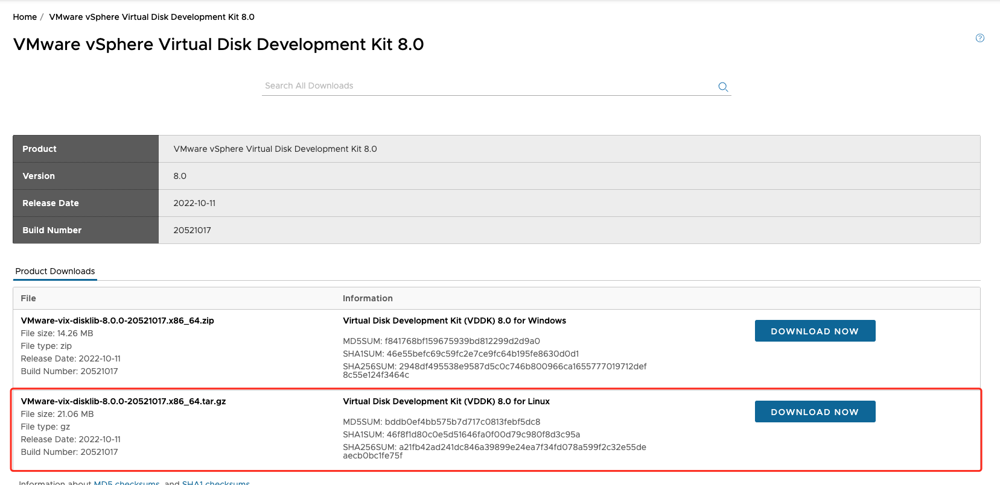

# 导入外部平台的 Ubuntu 操作系统的虚拟机

本文将详细介绍如何通过命令行将外部平台上的 Ubuntu 操作系统的虚拟机导入到 DCE 5.0的虚拟机中。

!!! info

    本文档外部虚拟平台是 VMware vSphere Client，后续简写为 vSphere。
    技术上是依靠 kubevirt cdi 来实现的。操作前，vSphere 上被导入的虚拟机需要关机。

## 获取 vSphere 的虚拟机基础信息

1. vSphere URL

    目标平台的 URL 地址信息

2. vSphere SSL 证书指纹 thumbprint

    需要通过 openssl 获取

    ```sh
    openssl s_client -connect 10.64.56.11:443 </dev/null | openssl x509 -in /dev/stdin -fingerprint -sha1 -noout
    ```
    输出类似于：
    ```output
    Can't use SSL_get_servername
    depth=0 CN = vcsa.daocloud.io
    verify error:num=20:unable to get local issuer certificate
    verify return:1
    depth=0 CN = vcsa.daocloud.io
    verify error:num=21:unable to verify the first certificate
    verify return:1
    depth=0 CN = vcsa.daocloud.io
    verify return:1
    DONE
    sha1 Fingerprint=C3:9D:D7:55:6A:43:11:2B:DE:BA:27:EA:3B:C2:13:AF:E4:12:62:4D  # 所需值
    ```

3. vSphere 账号
   
    获得 vSphere 的账号信息，注意权限问题

4. vSphere 密码

    获得 vSphere 的密码信息

5. 需要导入虚拟机的 UUID（需要在 vSphere 的 web 页面获取）

    - 进入 Vsphere 页面中，进入被导入虚拟机的详情页面，点击`编辑配置`，此时打开浏览器的开发者控制台，
      点击`网络` —> `标头`找到如下图所示的 URL。
    
        

    - 点击`响应`，定位到 `vmConfigContext` —> `config`，最终找到目标值 `uuid`。

        

6. 需要导入虚拟机的 vmdk 文件 path

## 获取 vSphere 的虚拟机基础信息

1. 准备 vddk 镜像

    - 下载 vddk：需要在 [vmware 网站](https://developer.vmware.com/) 注册账号后下载
   
        前往 SDKs，在"Compute Virtualization"部分点击，并选择合适版本的
        "VMware Virtual Disk Development Kit (VDDK)"进行下载。
   
        
   
        
   
        
   
    -  解压并构建成镜像：
   
        - 解压
       
            ```sh
            tar -xzf VMware-vix-disklib-<version>.x86_64.tar.gz
            ```
       
        - 创建 Dockerfile 文件
       
            ```sh
            FROM busybox:latest
            COPY vmware-vix-disklib-distrib /vmware-vix-disklib-distrib
            RUN mkdir -p /opt
            ENTRYPOINT ["cp", "-r", "/vmware-vix-disklib-distrib", "/opt"]
            EOF
            ```

        - 推送镜像至仓库

## 获取 vSphere 的账号密码 secret

```yaml
apiVersion: v1
kind: Secret
metadata:
  name: vsphere   # 可更改
  labels:
    app: containerized-data-importer  # 请勿更改
    type: Opaque
    data:
      accessKeyId: "username-base64"
      secretKey: "password-base64"
```

## 配置 kubevirt cdi configmap（vddk）

1. 在将 vSphere 虚拟机导入 KubeVirt 的 CDI 过程中，需要使用 vddk 组件。
   
2. 请确保 configmap 的命名空间与 CDI 所在的命名空间保持一致
  （Virtnest Agent 的默认命名空间是 virtnest-system，示例中为 cdi）。

    ```yaml
    apiVersion: v1
    kind: ConfigMap
    metadata:
      name: v2v-vmware
      namespace: cdi
      data:
        vddk-init-image: release-ci.daocloud.io/virtnest/vddk:v1
    ```

## 编写 kubevirt vm yaml 创建 vm

```yaml
    apiVersion: kubevirt.io/v1
    kind: VirtualMachine
    metadata:
      name: export-ubuntu-vddk
      namespace: default
    spec:
    dataVolumeTemplates:
        - metadata:
            name: systemdisk-export-ubuntu-vddk
            namespace: default
        spec:
            pvc:
            accessModes:
                - ReadWriteOnce
            resources:
                requests:
                storage: 20Gi
            storageClassName: local-path
            source:
            vddk:
                backingFile: "[esxi-d02-08-SSD] kubevirt-export-ubuntu-1/kubevirt-export-ubuntu-1.vmdk" # vsphere 虚拟机基础信息中的磁盘
                url: "https://10.64.56.11"   # vsphere url
                uuid: "4234ea54-9b4b-b8ba-3de0-8612d8600648" # vsphere 虚拟机基础信息中的 uuid
                thumbprint: "C3:9D:D7:55:6A:43:11:2B:DE:BA:27:EA:3B:C2:13:AF:E4:12:62:4D" # vsphere SSL fingerprint
                secretRef: "vsphere"  # vsphere 账号密码 secret
    runStrategy: Always
    template:
        metadata:
        creationTimestamp: null
        spec:
        architecture: amd64
        domain:
            devices:
            disks:
                - disk:
                    bus: virtio
                bootOrder: 1
                name: systemdisk-export
            interfaces:
                - masquerade: {}
                name: default
            machine:
            type: q35
            resources:
            limits:
                cpu: "1"
                memory: 2Gi
            requests:
                cpu: "1"
                memory: 1Gi
        networks:
            - name: default
            pod: {}
        volumes:
            - dataVolume:
                name: systemdisk-export-ubuntu-vddk
            name: systemdisk-export
```

## 进入 VNC 检查是否成功运行

1. 修改虚拟机的网络配置

1. 查看当前网络

    在实际导入完成时，如下图所示的配置已经完成。然而，需要注意的是，enp1s0接口并没有包含inet字段，因此无法连接到外部网络。
       
    

1. 配置 netplan

    在上图所示的配置中，将 ethernets 中的对象更改为 enp1s0，并使用 DHCP 获得 IP 地址。
        
    

1. 将 netplan 配置应用到系统网络配置中

    ```sh
    sudo netplan apply
    ```
 
1. 对外部网络进行 ping 测试

    

1. 通过 SSH 在节点上访问虚拟机。

    
