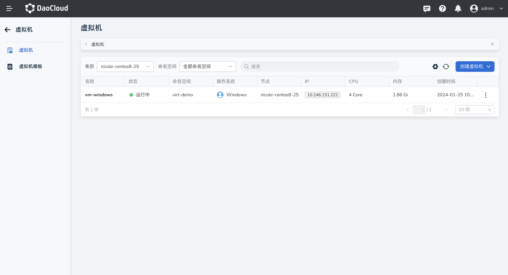

# 创建 Windows 虚拟机

本文将介绍如何通过命令行创建 Windows 虚拟机。

## 前提条件

1. 创建 Windows 虚拟机之前，需要先参考[安装虚拟机模块的依赖和前提](../install/install-dependency.md)确定您的环境已经准备就绪。
2. 创建过程建议参考官方文档：[How to install during Windows install](https://kubevirt.io/user-guide/virtual_machines/windows_virtio_drivers/#how-to-install-during-windows-install)
3. 如果虚拟机没有网络需要手动加载 Windows 网络引擎启动，参考官方文档 [How to install after Windows installation?](https://kubevirt.io/user-guide/virtual_machines/windows_virtio_drivers/#how-to-install-after-windows-install)
4. Windows 虚拟机建议使用 VNC 的访问方式。

## 上传 Windows 操作系统的镜像文件

1. 先开放 CDI 上传服务

    ```shell
    cat << EOF | kubectl  -n virtnest-system apply  -f -
    apiVersion: v1
    kind: Service
    metadata:
      labels:
        cdi.kubevirt.io: cdi-uploadproxy
      name: cdi-uploadproxy-nodeport
    spec:
      ports:
      - nodePort: 31001
        port: 443
        protocol: TCP
        targetPort: 8443
      selector:
        cdi.kubevirt.io: cdi-uploadproxy
      type: NodePort
    EOF
    ```

2. CDI 证书配置
   
    ```shell
    # 10.6.136.25 替换成节点 IP
    echo | openssl s_client -showcerts -connect 10.6.136.25:31001 2>/dev/null \
            | openssl x509 -inform pem -noout -text \
            | sed -n -e '/Subject.*CN/p' -e '/Subject Alternative/{N;p}'
    echo "10.6.136.25  cdi-uploadproxy" >> /etc/hosts
    
    kubectl patch cdi cdi \
        --type merge \
        --patch '{"spec":{"config":{"uploadProxyURLOverride":"https://cdi-uploadproxy:31001"}}}'
    
    kubectl get secret -n virtnest-system cdi-uploadproxy-server-cert \
        -o jsonpath="{.data['tls\.crt']}" \
        | base64 -d > cdi-uploadproxy-server-cert.crt
    
    sudo cp cdi-uploadproxy-server-cert.crt /etc/pki/ca-trust/source/anchors
    
    sudo update-ca-trust
    ```

3. 安装工具

    ```shell
    (
    set -x; cd "$(mktemp -d)" &&
    OS="$(uname | tr '[:upper:]' '[:lower:]')" &&
    ARCH="$(uname -m | sed -e 's/x86_64/amd64/' -e 's/\(arm\)\(64\)\?.*/\1\2/' -e 's/aarch64$/arm64/')" &&
    KREW="krew-${OS}_${ARCH}" &&
    curl -fsSLO "https://github.com/kubernetes-sigs/krew/releases/latest/download/${KREW}.tar.gz" &&
    tar zxvf "${KREW}.tar.gz" &&
    ./"${KREW}" install krew
    )
   
    echo 'export PATH="${KREW_ROOT:-$HOME/.krew}/bin:$PATH"' >> ~/.bashrc && bash --login
   
    kubectl krew install virt
    ```

4. 从 [Windows 官网](https://www.microsoft.com/en-us/evalcenter/download-windows-server-2012-r2) 下载 Windows ISO

    ```shell
    wget -O win.iso 'https://go.microsoft.com/fwlink/p/?LinkID=2195443&clcid=0x409&culture=en-us&country=US'
    ```

5. 上传 Windows ISO，并且创建一个引导盘

    ```shell
    kubectl virt image-upload -n virt-demo pvc iso-win \  # kubectl  virt image-upload -n ${NS} pvc ${PVC_NAME}
    --image-path=/root/win.iso \  # 所处绝对地址
    --access-mode=ReadWriteOnce \
    --size=25G \  # 引导盘大小，不能小于 15 GB
    --uploadproxy-url=https://cdi-uploadproxy:31001 \  # 上传服务端地址
    --force-bind \
    --insecure \
    --wait-secs=240 \
    --storage-class=local-path  # 集群支持的 SC
    ```

6. 创建数据盘

    ```shell
    kubectl apply -n virt-demo  -f - <<EOF
    apiVersion: v1
    kind: PersistentVolumeClaim
    metadata:
      name: winhd
      namespace: virt-demo
    spec:
    accessModes:
        - ReadWriteOnce
    resources:
        requests:
        storage: 20Gi
    storageClassName: local-path
    EOF
    ```

## 创建 Windows 虚拟机

??? note "点击查看创建 Windows 虚拟机的 YAML 示例"

    ```yaml
    apiVersion: kubevirt.io/v1
    kind: VirtualMachine
    metadata:
      annotations:
        kubevirt.io/latest-observed-api-version: v1
        kubevirt.io/storage-observed-api-version: v1
      labels:
        virtnest.io/os-family: Windows
        virtnest.io/os-version: 2012.r2
      name: vm-windows
      namespace: virt-demo
    spec:
      running: true
      template:
        metadata:
        creationTimestamp: null
        labels:  # 自定义 应用 label
          app: vm-windows
          version: v1
          kubevirt.io/domain: vm-windows
        spec:
          architecture: amd64
          domain:
            cpu:
              cores: 4
              sockets: 1
              threads: 1
            devices:
              disks:
                - bootOrder: 1
                  cdrom:
                    bus: sata
                  name: cdromiso
                - bootOrder: 2
                  disk:
                    bus: virtio
                  name: harddrive
                - bootOrder: 3
                  cdrom:
                    bus: sata
                  name: virtiocontainerdisk
            interfaces:
              - name: default
                passt: {}  # passt 模式
                ports:
                  - name: http
                    port: 80  # 应用端口号
            machine:
              type: q35
            resources:
              requests:
                memory: 2G
        networks:
            - name: default
              pod: {}
        volumes:
            - name: cdromiso
              persistentVolumeClaim:
                claimName: iso-win  # 自定义上传 ISO 的引导盘
            - name: harddrive
              persistentVolumeClaim:
                claimName: winhd  # 自定义的 数据盘
            - containerDisk:
                image: kubevirt/virtio-container-disk
              name: virtiocontainerdisk
    ```

## 访问 Windows 虚拟机

1. 创建成功后，进入虚拟机列表页面，发现虚拟机正常运行。

    

2. 点击控制台访问（VNC），可以正常访问。

    